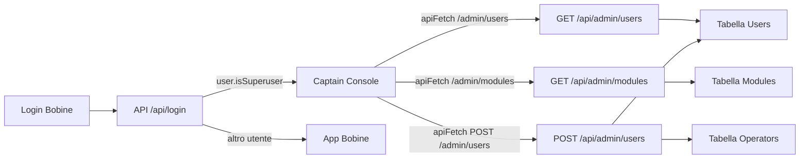

# Plan Fase 3: Captain Console CRUD e Routing

## Backend: API Admin in `serverbobine.js`

- **Aggiungere POST `/api/admin/users` con transazione**
  - Nella sezione `// --- API ADMIN / CAPTAIN CONSOLE ---` di [serverbobine.js](serverbobine.js), definire un endpoint `app.post('/api/admin/users', authenticateCaptain, async (req, res) => { ... })` usando il frammento fornito come base.
  - Usare `sql.connect(dbConfig)` e creare una `new sql.Transaction(pool)`, con `begin()`, `commit()` e `rollback()` nel blocco `try/catch` annidato, seguendo lo schema suggerito.
  - Inserire l'utente "Passaporto" in `[CMP].[dbo].[Users]` valorizzando `Name`, `Barcode`, `PasswordHash` (usando `bcrypt.hash(password || '123456', 10)`), `IsActive = 1`, e leggere `IDUser` via `OUTPUT INSERTED.IDUser`.
  - Gestire `roles` come array di `{ targetTable, roleKey }`: applicare una whitelist `const validTables = ['Operators', 'Operators_Man']` (estendibile in futuro) e saltare qualsiasi `targetTable` non valida.
  - Per `targetTable === 'Operators'`, calcolare `isAdmin = role.roleKey === 'Admin' ? 1 : 0` e inserire in `[CMP].[dbo].[Operators] (IDUser, Admin)` usando parametri tipizzati su `sql.Request(transaction)`.
  - In caso di errore interno nel blocco transazionale, chiamare `transaction.rollback()` e rilanciare l’eccezione; nel `catch` esterno loggare l’errore con `console.error('Errore POST /api/admin/users:', err)` e restituire `500` con `err.message`.
- **Aggiungere DELETE `/api/admin/users/:id` per soft delete globale**
  - Nella stessa sezione Admin, definire `app.delete('/api/admin/users/:id', authenticateCaptain, async (req, res) => { ... })` come da snippet.
  - Effettuare il parse di `req.params.id` in `Int` (es. `const idUser = parseInt(req.params.id, 10);`) e usare una query parametrizzata che setta `IsActive = 0` su `[CMP].[dbo].[Users]` per `IDUser = @idUser`.
  - Restituire `200` con JSON `{ message: 'Utente disattivato logicamente.' }` in caso di successo; su errore generico, rispondere con `500` e `err.message` mantenendo lo stile degli altri endpoint.

## Frontend Captain Console: modal Passaporto & Visti in `captain.html`

- **Aggiungere il markup del modal di creazione utente**
  - Prima del tag di chiusura `</body>` in [captain.html](captain.html), inserire il blocco HTML del modal fornito (`
 ... 
`), con campi `adminNewName`, `adminNewBarcode`, `adminNewPassword` e il container `dynamicRolesContainer`.
  - Mantenere lo stile coerente con le classi esistenti (`scanner-modal`, `scanner-modal-inner`, `scanner-cancel`, ecc.) e con la palette `var(--primary)`, `var(--success)`, `var(--border)` già usata nella pagina.
- **Generazione dinamica delle checkbox ruoli basata su `globalModules`**
  - All’interno del blocco `<script>` di [captain.html](captain.html), dopo le funzioni `initCaptainConsole` / `loadData` / `renderUsersTable`, implementare `openNewUserModal()` esattamente come nello snippet: pulizia dei campi input, reset del contenitore ruoli e creazione dinamica degli elementi.
  - Per ogni elemento in `globalModules` (già popolato da `/api/admin/modules` e con `roleDefinition` già `JSON.parse` lato backend), iterare su `Object.entries(mod.roleDefinition)` per ottenere `roleKey` e `roleInfo`, costruendo gruppi per modulo con etichette e checkbox.
  - Ogni checkbox deve avere `class="role-checkbox"` e attributi `data-target-table="${mod.targetTable}"` e `data-role-key="${roleKey}"`, mentre il testo visibile usa `roleInfo.label`.
  - Alla fine di `openNewUserModal()`, applicare le classi del modal: aggiungere `is-open` e `aria-hidden="false"` all’elemento `adminUserModal`.
- **Wiring degli event listener e chiamata alla nuova API**
  - In fondo allo `<script>` (dopo l’inizializzazione della navigazione e prima o dopo `initCaptainConsole()` a seconda dello stile esistente), aggiungere gli event listener suggeriti:
    - Click sul bottone `+ Nuovo Utente` (`button.action-btn`) per aprire il modal (`openNewUserModal()`). Per garantire il funzionamento dopo i re-render di `renderUsersTable()`, collegare il listener dopo ogni render (es. richiamando un helper `bindUsersHeaderActions()` da `renderUsersTable()`) o usando event delegation sul contenitore `view-utenti`, mantenendo comunque la firma dello snippet.
    - Click su `#adminUserCancelBtn` per chiudere il modal rimuovendo `is-open` e aggiornando `aria-hidden`.
    - Click su `#adminUserSaveBtn` per raccogliere `name`, `barcode`, `password` (opzionale) e le checkbox selezionate in `selectedRoles = [{ targetTable, roleKey }, ...]`.
  - Nello handler di `Salva`, eseguire `apiFetch('/admin/users', { method: 'POST', headers: { 'Content-Type': 'application/json' }, body: JSON.stringify({ name, barcode, password, roles: selectedRoles }) })` come nello snippet, chiudere il modal alla fine e chiamare `loadData()` per ricaricare la griglia utenti.
  - Gestire la validazione minima lato client: se `name` o `barcode` sono vuoti, mostrare un `alert('Nome e Barcode sono obbligatori')` e non invocare l’API.

## Frontend Bobine: routing sicuro verso Captain Console in `app.js`

- **Adattare la logica di `performLogin()` dopo il parse JSON**
  - In [app.js](app.js), individuare `async function performLogin()` e la parte finale dove, dopo `const data = await res.json();`, oggi viene eseguito:
    - `state.currentOperator = data.user || null;`
    - `updateCurrentOperatorUI();`
    - `applyPermissions();`
    - `closeLoginModal();`
    - `if (!state.logs || state.logs.length === 0) { await loadInitialData(); }`.
  - Sostituire questa sezione con il blocco richiesto:
    - Dopo `const data = await res.json();`, se `data.user && data.user.isSuperuser`, fare `window.location.href = 'captain.html';` e `return;`, così il Superuser non viene inserito nel flusso operativo Bobine ma viene reindirizzato direttamente alla Captain Console.
    - Nel caso normale (operatori di reparto), mantenere il flusso attuale: impostare `state.currentOperator`, aggiornare la UI con `updateCurrentOperatorUI()`, chiamare `applyPermissions()`, chiudere il modal via `closeLoginModal()` e, se i log non sono ancora caricati, invocare `await loadInitialData();`.
  - Non modificare la gestione di errori precedenti (401 con `requiresPassword`, messaggi di errore, ecc.), assicurando che la semantica di richiesta password e feedback utente rimanga invariata.

## Note architetturali (Passaporto & Visto)

- **Coerenza con il modello Passaporto/Visto**
  - Garantire che la creazione utente tramite Captain Console usi sempre la tabella globale `[CMP].[dbo].[Users]` come fonte di verità dell’identità (Passaporto) e che qualunque vista modulare (es. `[CMP].[dbo].[Operators]`) venga popolata solo tramite il mapping delle `roles`.
  - Mantenere la tabella `Users` come unico punto di soft delete globale (`IsActive = 0`), lasciando alle future evoluzioni la gestione di eventuali disattivazioni per–modulo.

