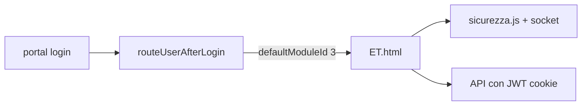

# Plan: integración Etichette, Captain dinámico y Zero-Trust

## Contexto del código actual

- **[portal.js](c:\Users\depel\Documents\progetto\ujet\bobine\portal.js):** `routeUserAfterLogin` solo redirige `defaultModuleId === 1` → `bobine.html`, `=== 2` → `captain.html`; el resto cae en fallback (bobine/captain según superuser).
- **[captain.html](c:\Users\depel\Documents\progetto\ujet\bobine\captain.html):** La lógica está en el mismo archivo (no hay `captain.js`). Los módulos ya se cargan con `apiFetch('/admin/modules')` en `loadData` (líneas ~741–747). El select de **nuevo usuario** es `adminNewDefaultModule`; el de **editar usuario** en el panel es `**umpDefaultModule`** (no existe `adminEditDefaultModule` en el repositorio).
- **[ET.html](c:\Users\depel\Documents\progetto\ujet\bobine\ET.html):** Cuatro `fetch`: productos, componentes, etiqueta GET y guardado POST a `/api/label/save`. No incluye aún `sicurezza.js` ni `socket.io` (a diferencia de [bobine.html](c:\Users\depel\Documents\progetto\ujet\bobine\bobine.html) y [captain.html](c:\Users\depel\Documents\progetto\ujet\bobine\captain.html)).
- **API módulos:** endpoint real `**/api/admin/modules`**, vía `apiFetch` que ya fuerza `credentials: 'include'`. Objetos con `**id`** y `**name**` (no `IDModule` / `ModuleName`).

## PASSO 1 — Router en portal.js

En `routeUserAfterLogin`, **antes** del fallback final, añadir (orden recomendado: tras las ramas 1 y 2):

```js
if (user.defaultModuleId === 3) {
  window.location.href = '/ET.html';
  return;
}
```

**Nota:** Confirmar en base de datos que el módulo Etichette tiene `IDModule = 3`; si no, ajustar el número.

## PASSO 2 — Menús en captain.html

**HTML**

- En `adminNewDefaultModule`: dejar una sola opción placeholder `**-- Seleziona App --`** (sustituir el texto actual *Seleziona prima i Visti* en el markup inicial).
- En `umpDefaultModule`: una sola opción `**-- Seleziona App --*`* (unificar con el placeholder pedido; hoy dice *Seleziona*).

**JS — `populateModulesDropdowns`**

- Implementar función `async function populateModulesDropdowns()` que:
  - Use `**apiFetch('/admin/modules')**` (mismo patrón que el resto del Captain; equivale a `fetch` con credenciales y manejo 401/403).
  - Rellene `**adminNewDefaultModule**` y `**umpDefaultModule**` con `innerHTML` placeholder + opciones `value="${mod.id}"` / texto `mod.name`.
- Invocarla **al final del bloque exitoso de `loadData()`**, cuando ya existan `users` y `modules` (por ejemplo justo después de asignar `allModules = modules`), para no depender de un segundo orden de llamadas.

**Refactor necesario para no romper el flujo**

- Hoy `**loadModules()`** repuebla `umpDefaultModule` y el filtro `filterAppSelect`; `**openUserManager`** vuelve a reconstruir `umpDefaultModule` desde `globalModules`; `**updateNewUserDynamicFields`** reconstruye `adminNewDefaultModule` solo con apps de los “visti” seleccionados.
- Para cumplir el requisito de lista **completa desde API** y evitar borrar las opciones:
  - Extraer o reutilizar la lógica de `populateModulesDropdowns` y **eliminar la duplicación** en `loadModules()` para `umpDefaultModule` (dejar en `loadModules()` solo la parte de `**filterAppSelect`**).
  - En `**openUserManager`**: en lugar de reconstruir opciones, asignar solo `defaultSelect.value` según `u.defaultModuleId` (las opciones ya vienen de `populateModulesDropdowns`).
  - En `**updateNewUserDynamicFields`**: **no** sustituir el `innerHTML` de `adminNewDefaultModule` (mantener solo la lógica de etiqueta password obligatoria / opcional).
  - En `**openNewUserModal`**: **no** hacer `innerHTML` que deje el select con una sola opción; resetear con `value = ''` (u opción equivalente) para no perder las opciones cargadas.

Con esto se respeta Bootstrap/CSS existente: solo markup mínimo de `<option>` y JS.

## PASSO 3 — Seguridad en ET.html

Antes de `</head>`, en el mismo orden que en bobine/captain:

```html
<script src="/socket.io/socket.io.js"></script>
<script src="sicurezza.js"></script>
```

(Ruta relativa `sicurezza.js` en la raíz del sitio, coherente con el resto del proyecto.)

## PASSO 4 — `credentials: 'include'` en ET.html

Añadir `credentials: 'include'` a **las cuatro** llamadas `fetch`:

- `loadProducts` — GET `/api/products?...`
- `loadComponents` — GET `/api/components/...`
- `loadLabelData` — GET `/api/label?...`
- Donde corresponda el POST de guardado (tras PASSO 5)

## PASSO 5 — Guardado PoC en ET.html

En `**saveRecord()`**:

- Sustituir URL por `**POST /api/etichette/salva`**.
- Cabeceras: `Content-Type: application/json` y `**credentials: 'include'`**.
- Cuerpo **solo**:
  - `**CodicePadre`:** obligatorio — usar `state.selectedPadre` o el valor coherente con el padre ya cargado (p. ej. tras validar que no esté vacío; alineado con `et_kcodart` del formulario si sigue presente).
  - `**Descrizione`:** opcional — para la PoC puede enviarse `""` o el valor de un campo de descripción si se quiere probar texto (p. ej. primer textarea `et_desc_r1` si existe en el DOM).
- Eliminar o no depender del `payload` completo del formulario para esta petición (fase 1 acordada).

**Riesgo explícito (aceptado en fase 1):** el editor dejará de persistir el resto de campos hasta la fase 2 en backend/UI.

## Diagrama de flujo (alto nivel)




## Archivos a tocar


| Archivo                                                                    | Cambios                                                                                                                                                      |
| -------------------------------------------------------------------------- | ------------------------------------------------------------------------------------------------------------------------------------------------------------ |
| [portal.js](c:\Users\depel\Documents\progetto\ujet\bobine\portal.js)       | Rama `defaultModuleId === 3` → `/ET.html`                                                                                                                    |
| [captain.html](c:\Users\depel\Documents\progetto\ujet\bobine\captain.html) | Placeholders selects, `populateModulesDropdowns`, ajustes `loadData` / `loadModules` / `openUserManager` / `updateNewUserDynamicFields` / `openNewUserModal` |
| [ET.html](c:\Users\depel\Documents\progetto\ujet\bobine\ET.html)           | Scripts en `<head>`, `credentials` en fetch, `saveRecord` → `/api/etichette/salva`                                                                           |


No se modifica CSS Bootstrap ni hojas de estilo salvo lo estrictamente necesario (no previsto).

## Opcional (fuera del alcance de los 5 passos)

- [profile.js](c:\Users\depel\Documents\progetto\ujet\bobine\profile.js): el botón “Atrás” solo distingue módulo 2 vs resto; usuarios con app por defecto Etichette podrían ir a `bobine.html` por error. Se puede alinear en una iteración posterior.

