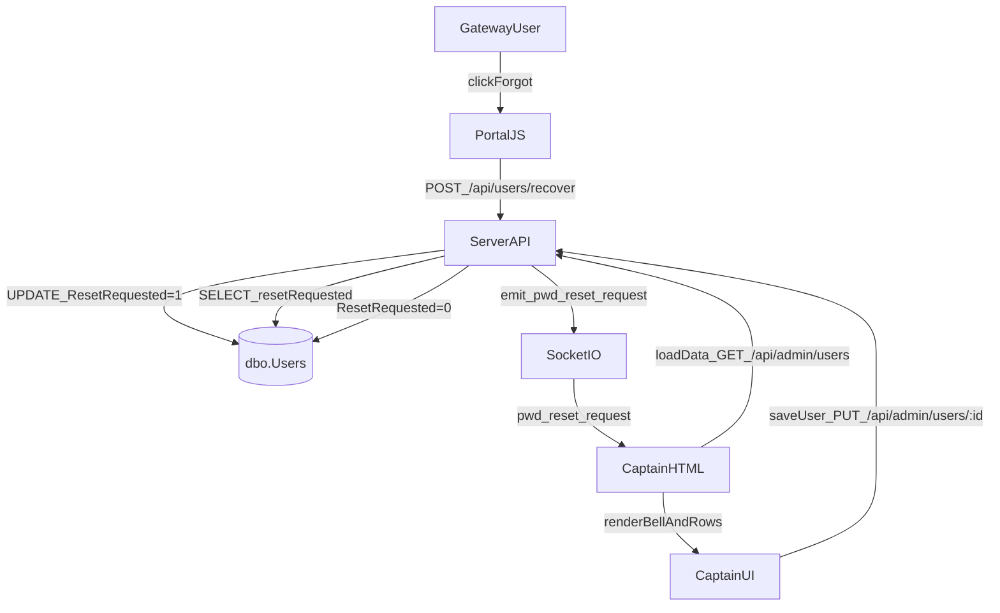

## Alcance y objetivo

- **Persistencia**: usar `[CMP].[dbo].[Users].ResetRequested` (BIT) para que una petición de “forgot password” quede **persistente** hasta que el Captain la resuelva guardando el usuario.
- **Realtime**: seguir emitiendo `pwd_reset_request` por Socket.io y, además, forzar refresh visual de Captain al recibirlo.

## Archivos a modificar

- Documentación: `[conoscenze.txt](conoscenze.txt)`
- Backend/API + Socket.io: `[serverbobine.js](serverbobine.js)`
- Gateway login/forgot: `[portal.js](portal.js)`
- Captain UI: `[captain.html](captain.html)`
- Captain estilos: `[captain.css](captain.css)`

## Cambios detallados

### 1) Documentación (`conoscenze.txt`)

- En la sección **“### 1.1 Tabella [dbo].[Users] (Il Passaporto)”**, añadir el bullet:
  - `ResetRequested` (BIT): Flag (0/1) que indica se l'utente ha richiesto un reset della password dal gateway. Usato per persistere l'allarme nella Captain Console fino a risoluzione.

### 2) Backend (`serverbobine.js`)

#### 2A. Ruta `POST /api/users/recover` activa el flag

- En la ruta existente (actualmente hace solo `SELECT IDUser, Name ...`), sustituir la query por un batch:
  - `UPDATE [CMP].[dbo].[Users] SET ResetRequested = 1 WHERE Barcode = @barcode AND IsActive = 1;`
  - `SELECT IDUser, Name FROM [CMP].[dbo].[Users] WHERE Barcode = @barcode AND IsActive = 1;`
- Mantener el resto de lógica (404 si no existe, y `io.to('captains_room').emit('pwd_reset_request', ...)`).

#### 2B. Ruta `GET /api/admin/users` expone el flag

- En el `SELECT` de usuarios activos (hoy termina con `DefaultModuleID`), añadir:
  - `ResetRequested as resetRequested`
- En el `map` posterior, **no es necesario** transformar a boolean si llega como BIT (0/1), pero conviene que el frontend lo trate como truthy/falsy. Si se quiere ser estricto, normalizar a `!!u.resetRequested` en el map.

#### 2C. Ruta `PUT /api/admin/users/:id` apaga el flag al guardar

- En `updateQuery` (hoy setea `DefaultModuleID = @defaultModuleId` y luego concatena password/LastBarcodeChange), añadir **en el bloque base**:
  - `ResetRequested = 0`
- Esto garantiza que cualquier guardado “resuelve” la alarma.

### 3) Gateway (`portal.js`) – sipario de confirmación antes del POST

- Reemplazar **todo** el bloque actual `if (forgotPwdLink) { ... }` (líneas ~210–249) por el bloque proporcionado, que:
  - exige barcode
  - muestra overlay confirmatorio
  - si confirma, llama `POST /api/users/recover`
  - muestra mensaje éxito/error en `loginMessageEl`

### 4) Captain estilos (`captain.css`)

- Añadir al final del archivo:
  - `@keyframes pulse-red { ... }`
  - `.blinking-pwd-alert { ... }`

### 5) Captain UI (`captain.html`)

#### 5A. Topbar con campana

- Reemplazar el `<header class="topbar-console"> ... </header>` actual (hoy solo título + Admin) por la versión con:
  - `#pwdAlertBell` (oculto por defecto)
  - `#pwdAlertCount`

#### 5B. Campana en `loadData()`

- En `async function loadData()` justo después de `globalModules = modules;` insertar el snippet:
  - cuenta `globalUsers.filter(u => u.resetRequested).length`
  - muestra/oculta `#pwdAlertBell` y actualiza `#pwdAlertCount`

#### 5C. Resaltado de fila en `renderUsersTable()`

- Antes de construir el `<tr>`, calcular:
  - `rowAlertStyle` y `alertIcon` según `u.resetRequested`
- Sustituir el `<tr ...>` y el `<td>` del nombre por el bloque indicado para:
  - fondo rojo suave + borde izquierdo
  - icono 🔔 junto al nombre

> Nota técnica: el snippet del prompt tiene **dos atributos `style`** en el `<tr>` (eso pisa el anterior en HTML). En la implementación se unificará en **un solo `style="... ${rowAlertStyle}"`**.

#### 5D. Modale “Gestisci” – borde rojo y force check

- En `openUserManager(id)`, en el bloque:
  - `if (needsPassword) { pwdSection.style.display = 'block'; } else { ... }`
- Sustituir por el bloque extendido:
  - si `u.resetRequested`: añade clase `blinking-pwd-alert`, fuerza `umpForcePwdChange` a `true`, scroll suave a la sección
  - si no: quita clase y respeta `u.forcePwdChange`
- En el `else` (cuando `needsPassword` es false), además de `pwdSection.style.display = 'none';` añadir `pwdSection.classList.remove('blinking-pwd-alert');`.

#### 5E. Realtime: refrescar al evento socket

- En `initCaptainConsole()`, en el handler `captainSocket.on('pwd_reset_request', ...)`, añadir `loadData();` al final del handler.
- En tu archivo actual, el handler `pwd_reset_request` está **duplicado** (aparece dos veces consecutivas). En el cambio, dejar **un único handler** para evitar doble alerta y doble `loadData()`.

## Flujo final esperado

## Test plan (manual)

- En `index`/gateway, introducir un barcode válido y pulsar “forgot password”:
  - cancelar: no debe llamar API ni cambiar nada
  - confirmar: debe devolver OK y mostrar mensaje de “allarme inviato”
- Abrir `captain.html` logueado como superuser:
  - al recibir socket: aparece alert modal y **se refresca** tabla/campana
  - la campana muestra el contador correcto y las filas se resaltan con 🔔
- Abrir “Gestisci” sobre un usuario con `resetRequested=1`:
  - la sección password tiene borde/animación y `Forza reset` queda marcado
- Guardar el usuario (botón “Salva Sicurezza”):
  - `ResetRequested` vuelve a 0, desaparece el resaltado y el contador baja.

