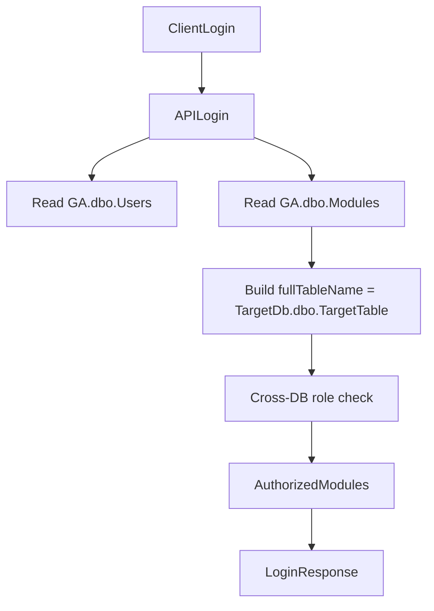

## Obiettivo

Aggiornare il backend Node.js (principalmente `serverbobine.js`) per usare i database `GA`, `CAP`, `BOB` con schema `dbo`, sostituendo tutti i riferimenti hardcoded a `CMP` e passando da `TargetSchema` a `TargetDb` nella logica di RBAC e routing dinamico.

## Assunzioni

- **DB gateway**: tutte le entità globali (`Users`, `SystemConfig`, `Modules`) risiedono in `GA.dbo`.
- **DB Captain**: la tabella `Captains` è ora in `CAP.dbo.Captains`.
- **DB Bobine**: tutte le tabelle prima sotto `CMP.Bobine` (es. `Log`, `Operators`, `Machines`) ora sono in `BOB.dbo` con lo stesso nome tabellare.
- La colonna `TargetSchema` della tabella `Modules` è stata rinominata in `TargetDb` e contiene il nome del database di destinazione (`GA`, `CAP`, `BOB`, ...), mentre le tabelle di destinazione sono sempre in `dbo`.

## Piano dettagliato

### 1. Aggiornare la configurazione di connessione MSSQL

- **File**: `[serverbobine.js](serverbobine.js)`
- **Passi**:
  - Individuare l’oggetto `dbConfig` usato da `mssql`.
  - Modificare il campo `database: 'CMP'` in `database: 'GA'` per fare in modo che la pool di default punti al database gateway `GA`.
  - Verificare che tutte le `sql.connect(dbConfig)` continuino a funzionare senza ulteriori modifiche, dato che le query useranno riferimenti fully-qualified per altri database.

### 2. Aggiornare tutte le query statiche verso entità globali (GA)

- **File**: `[serverbobine.js](serverbobine.js)`
- **Entità coinvolte**: `Users`, `SystemConfig`, `Modules` usati come dati globali.
- **Passi**:
  - Cercare tutte le stringhe SQL contenenti riferimenti a `CMP` con schema `dbo` per queste tabelle, e sostituire:
    - `[CMP].[dbo].[Users]` → `[GA].[dbo].[Users]`
    - `[CMP].[dbo].[SystemConfig]` → `[GA].[dbo].[SystemConfig]`
    - `[CMP].[dbo].[Modules]` → `[GA].[dbo].[Modules]`
  - Punti noti:
    - Helper `getEffectivePwdRules` (SELECT da `SystemConfig` e `Users`).
    - Rotte `/api/admin/config` (GET/PUT) che manipolano `SystemConfig`.
    - Rotte utente globali (`/api/admin/users`, `/api/me`, `/api/users/...`) che selezionano/aggiornano `Users`.
    - Rotte `/api/admin/modules` e logica RBAC che leggono/aggiornano `Modules`.
  - Mantenere intatta la logica applicativa (override regole password, forzatura cambio password, ecc.), modificando solo il database di destinazione nelle stringhe SQL.

### 3. Aggiornare le query per tabelle Bobine al nuovo DB `BOB`

- **File**: `[serverbobine.js](serverbobine.js)`
- **Entità coinvolte**: `Bobine.Operators`, `Bobine.Machines`, `Bobine.Log`.
- **Passi**:
  - Individuare tutte le query che puntano a `[CMP].[Bobine].`* e sostituire con l’equivalente in `BOB.dbo`:
    - `[CMP].[Bobine].[Operators]` → `[BOB].[dbo].[Operators]`
    - `[CMP].[Bobine].[Machines]` → `[BOB].[dbo].[Machines]`
    - `[CMP].[Bobine].[Log]` → `[BOB].[dbo].[Log]`
  - Aggiornare tutte le JOIN dove tabelle Bobine si uniscono con `Users` o altre tabelle già migrate (`GA.dbo.Users`).
  - Punti noti:
    - Rotte `/api/operators` (CRUD), `/api/machines` (GET/POST).
    - Rotte `/api/logs` (lista, history, insert, update, delete, bobina_finita), incluse query per temporal tables (`FOR SYSTEM_TIME ALL`).

### 4. Aggiornare le query per la Captain Console al DB `CAP`

- **File**: `[serverbobine.js](serverbobine.js)`
- **Entità coinvolta**: `Captains`.
- **Passi**:
  - Trovare la query che usa `[CMP].[Captain].[Captains]` (nella rotta `/api/login` per verificare il superuser).
  - Sostituire con `[CAP].[dbo].[Captains]` secondo la nuova architettura.
  - Verificare che eventuali riferimenti a colonne (`IDUser`, `IsActive`) restino invariati.

### 5. Aggiornare le query su `Modules` e routing dinamico (TargetDb)

- **File**: `[serverbobine.js](serverbobine.js)`
- **Scenario**: lettura dei moduli per calcolare ruoli, assegnare permessi e preparare la lista moduli lato login.

#### 5.1. Lettura moduli per vista utenti admin (`GET /api/admin/users`)

- **Punto attuale**: SELECT `TargetSchema`, `TargetTable` da `[CMP].[dbo].[Modules]` e costruzione `fullTableName` come `[CMP].[${mod.TargetSchema}].[${mod.TargetTable}]`.
- **Modifiche**:
  - Cambiare la SELECT a:
    - `SELECT IDModule, ModuleName, TargetDb, TargetTable, RoleDefinition FROM [GA].[dbo].[Modules]`.
  - Aggiornare il codice che usa il risultato:
    - Sostituire `mod.TargetSchema` con `mod.TargetDb`.
    - Costruire `fullTableName` come `[${mod.TargetDb}].[dbo].[${mod.TargetTable}]`.
  - Verificare i rami condizionali su `mod.TargetTable` (`Operators`, `Captains`) per assicurarsi che le query usino `fullTableName` aggiornato.

#### 5.2. Aggiornare assegnazione ruoli per utente (`PUT /api/admin/users/:id/roles`)

- **Punto attuale**: SELECT `TargetSchema`, `TargetTable` da `[CMP].[dbo].[Modules]` e costruzione di `fullTable = '[CMP].[${schema}].[${table}]'`.
- **Modifiche**:
  - Cambiare la SELECT a: `SELECT TargetDb, TargetTable FROM [GA].[dbo].[Modules]`.
  - Usare `mod.TargetDb` al posto di `TargetSchema` e costruire `fullTable` come `[${mod.TargetDb}].[dbo].[${mod.TargetTable}]`.
  - Lasciare invariata la logica di validazione `submittedRoles` e l’upsert dei permessi, modificando solo il nome fully-qualified della tabella.

#### 5.3. Creazione nuovo utente e assegnazione ruoli (`POST /api/admin/users`)

- **Punto attuale**: SELECT `TargetSchema`, `TargetTable` da `[CMP].[dbo].[Modules]` e costruzione `fullTable` `[CMP].[${schema}].[${table}]` durante l’assegnazione iniziale dei ruoli.
- **Modifiche**:
  - Aggiornare la SELECT in `SELECT TargetDb, TargetTable FROM [GA].[dbo].[Modules]`.
  - Sostituire `modDef.TargetSchema` con `modDef.TargetDb`.
  - Costruire `fullTable` come `[${modDef.TargetDb}].[dbo].[${modDef.TargetTable}]`.

#### 5.4. Calcolo moduli autorizzati in login (`POST /api/login`)

- **Punto attuale**: SELECT `TargetSchema`, `TargetTable` da `[CMP].[dbo].[Modules]` e `fullTableName = [CMP].[${TargetSchema}].[${TargetTable}]` per verificare se l’utente ha accesso a `Operators`, `Captains`, ecc.
- **Modifiche**:
  - Modificare la query a `SELECT IDModule, ModuleName, TargetDb, TargetTable, RoleDefinition, AppSettings FROM [GA].[dbo].[Modules]`.
  - Aggiornare tutte le referenze a `TargetSchema` con `TargetDb`.
  - Cambiare la costruzione di `fullTableName` in `[${mod.TargetDb}].[dbo].[${mod.TargetTable}]`.
  - Mantenere invariata la logica di interpretazione di `RoleDefinition` e generazione della lista moduli restituita al client.

### 6. Adeguare le query di gestione moduli admin (senza cambiare la logica di business)

- **File**: `[serverbobine.js](serverbobine.js)`
- **Rotte**: `/api/admin/modules` (GET) e `/api/admin/modules/:id` (PUT).
- **Passi**:
  - Aggiornare il SELECT dei moduli da `[CMP].[dbo].[Modules]` a `[GA].[dbo].[Modules]`.
  - Assicurarsi che il modello dati usato lato backend includa anche `TargetDb` se serve al frontend (in caso il client debba visualizzarlo).
  - Lasciare invariata la logica di aggiornamento (`UPDATE ... SET RoleDefinition = @roleDef, AppSettings = @appSet`), adattando solo il database della tabella (`[GA].[dbo].[Modules]`).

### 7. Verifica delle rotte e impatto

- **File**: `serverbobine.js`
- **Passi**:
  - Preparare un elenco sintetico delle rotte toccate (almeno):
    - `/api/operators` (tutti i metodi)
    - `/api/machines` (GET/POST)
    - `/api/admin/users` (GET/POST/PUT/DELETE/reorder/deleted/restore/duplicate-check)
    - `/api/admin/modules` (GET/PUT)
    - `/api/admin/config` (GET/PUT)
    - `/api/logs` (tutti i metodi)
    - `/api/login`
    - `/api/me`, `/api/users/me/password`, `/api/users/recover`
  - Per ciascuna rotta, verificare che:
    - Le tabelle globali puntino a `GA.dbo`.
    - Le tabelle Bobine puntino a `BOB.dbo`.
    - I riferimenti alla Captain Console puntino a `CAP.dbo`.
    - Le costruzioni dinamiche di `fullTableName` usino `TargetDb` + `dbo`.

### 8. (Opzionale) Diagramma concettuale flusso moduli e DB

Per chiarezza architetturale, rappresentare il flusso di risoluzione dei moduli e dei ruoli in login con un diagramma mermaid:

