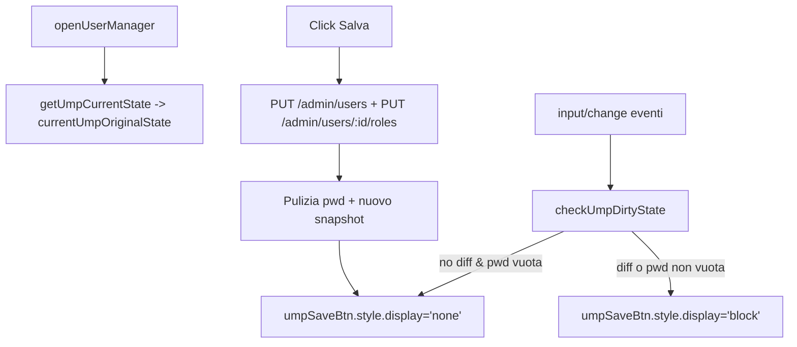

## Allineamento backend a IDENTITY e UX Captain

### 1. Pulizia backend in `serverbobine.js`

- **POST `/api/operators`**
  - Localizzare la rotta esistente in `[serverbobine.js](serverbobine.js)` (circa righe 148–196).
  - Sostituire il blocco di INSERT in `[CMP].[Bobine].[Operators]` che usa `DECLARE @newId ... MAX(IDOperator)` con la versione senza ID esplicito:
    - `INSERT INTO [CMP].[Bobine].[Operators] (IDUser, Admin, StartTime, IsActive) VALUES (@idUser, @admin, @startTime, 1)`.
  - Verificare che non restino riferimenti a `@newId` o a `IDOperator` nell'INSERT.
- **PUT `/api/admin/users/:id/roles`**
  - Nella rotta 2b (circa righe 444–500 di `[serverbobine.js](serverbobine.js)`), individuare il ciclo sui moduli e il blocco `if (assignedRole) { ... }`.
  - Sostituire l’intera query SQL di quel blocco con la versione unificata fornita, che:
    - Fa `UPDATE ... SET IsActive = 1, ${roleCol} = ... WHERE IDUser = @id` se la riga esiste.
    - Altrimenti esegue `INSERT INTO ${fullTable} (IDUser, ${roleCol}, IsActive) VALUES (@id, ..., 1)` senza più calcolo manuale dell’ID e senza colonna PK nell’INSERT.
  - Rimuovere eventuali variabili non più usate (`idCol`) per mantenere il codice pulito.
- **POST `/api/admin/users` (creazione utente globale + visti)**
  - Nella rotta di creazione utente (circa righe 589–665 di `[serverbobine.js](serverbobine.js)`), entrare nel blocco `if (roles && roles.length > 0)` e nel `for (const role of roles)`.
  - All’interno del `try { ... } catch` di ciascun ruolo, sostituire il codice di INSERT che fa `DECLARE @newId = ISNULL(MAX(...)) + 1` per Captains e Operators con il nuovo schema:
    - Per `Captains`: solo `INSERT INTO ${fullTable} (IDUser, ${roleCol}, IsActive) VALUES (@idUser, 'Master', 1)`.
    - Per gli altri (Operators): `INSERT INTO ${fullTable} (IDUser, ${roleCol}, IsActive) VALUES (@idUser, @admin, 1)` dopo aver valorizzato `@admin` con `isAdmin`.
  - Lasciare intatta la gestione degli errori `catch (e) { console.error(...) }`.
- **POST `/api/logs`**
  - Nella rotta di inserimento log (circa righe 1154–1181 di `[serverbobine.js](serverbobine.js)`), sostituire la query che inserisce in `[CMP].[Bobine].[Log]`:
    - Rimuovere la colonna `IDLog` dall’elenco e la subquery `((SELECT ISNULL(MAX(IDLog), 0) + 1 ...))`.
    - Usare la nuova forma:
      - `INSERT INTO [CMP].[Bobine].[Log] (Date, IDOperator, IDMachine, Codart, Lot, Quantity, Notes, IDRoll, bobina_finita) VALUES (@Date, @IDOperator, @IDMachine, @Codart, @Lot, @Quantity, @Notes, @IDRoll, NULL)`.
  - Verificare che nessuna altra rotta faccia INSERT in `Log` con ID esplicito.
- **Verifiche backend**
  - Rieseguire un breve smoke test manuale (o via client esistente) per:
    - Creare un nuovo operatore.
    - Creare un nuovo utente admin con ruoli Captains/Operators.
    - Aggiornare ruoli di un utente esistente.
    - Inserire un nuovo log di produzione.
  - Controllare che gli ID vengano assegnati correttamente dal database e che non vi siano errori SQL relativi alle PK.

### 2. UX Captain: regole password e dirty state in `captain.html`

- **2.1. Variabili globali e bottone Salva unico**
  - Verificare in `[captain.html](captain.html)` che:
    - Esista un solo bottone "Salva" globale per il pannello utente (`id="umpSaveBtn"` nella testata del modale), come già presente.
    - Non ci siano altri bottoni "Salva" nelle sezioni `.ump-content-section`; in caso contrario, rimuoverli o rinominarli per non confondere l’utente.
  - Confermare che le variabili globali `currentUmpOriginalState` e `currentUmpEditingId` sono dichiarate in testa allo script (righe 360–366) e mantenerle come stato unico di tracking.
- **2.2. Popolamento intelligente delle regole password**
  - Nella funzione `openUserManager(id)` (circa righe 877–1049 di `[captain.html](captain.html)`), individuare il blocco dove si calcolano `hasOverride` e si assegnano i valori ai campi:
    - `umpPwdMinLen`, `umpPwdReqNum`, `umpPwdReqUpp`, `umpPwdReqSpec`.
  - Sostituire il blocco di assegnazione esistente (da `if (minLenEl) minLenEl.value = ...` fino alle checkbox) con la versione richiesta che:
    - Usa sempre i default globali se l’override dell’utente è `null`, popolando comunque i campi.
    - Usa direttamente i valori di override se presenti (non più l’`hasOverride` aggregato):
      - `minLenEl.value = u.pwdMinLengthOverride !== null ? u.pwdMinLengthOverride : getGlobalVal('PwdMinLength', '6');`
      - Checkbox che confrontano `...Override !== null` per decidere se usare il valore utente o il default globale.
  - Lasciare invariata la logica che mostra/nasconde `umpOverrideSettings` in base alla presenza di override, ma assicurarsi che combinata con il nuovo popolamento offra un UX coerente: se l’utente disattiva "Usa Globali", i campi sono già valorizzati con i globali.
- **2.3. Tracciamento dirty state per `umpSaveBtn`**
  - Riutilizzare le funzioni già presenti `getUmpCurrentState()` e `checkUmpDirtyState()` (righe 485–539), che:
    - Raccolgono i valori dei principali input (nome, barcode, password, checkbox, scadenza, defaultModule, toggle "Usa Globali", regole override).
    - Considerano la password non vuota come sempre dirty.
    - Confrontano lo snapshot `currentUmpOriginalState` con lo stato attuale per decidere se mostrare il bottone `umpSaveBtn`.
  - Adeguare gli eventi di aggancio allo stato dirty:
    - In `DOMContentLoaded`, estendere il selettore da `querySelectorAll('input, select')` a `querySelectorAll('input, select, textarea')` per coprire eventuali future note/campi testuali.
    - Verificare che anche i toggle chiave (`umpUseGlobalPwd`, checkbox ruoli nella Tab 3) chiamino o inneschino `checkUmpDirtyState` dopo ogni cambiamento (aggiungendo `checkUmpDirtyState()` nei rispettivi handler se mancante).
  - Dopo ogni apertura di `openUserManager(id)`:
    - Continuare a scattare uno snapshot `currentUmpOriginalState = getUmpCurrentState()` con un piccolo `setTimeout` per attendere il rendering, e chiamare `checkUmpDirtyState()` per nascondere il pulsante finché non interviene una modifica reale.
- **2.4. Reset snapshot dopo salvataggio**
  - All’interno del listener click di `umpSaveBtn` (righe 1378–1457 di `[captain.html](captain.html)`), alla fine del blocco `try` dopo i due salvataggi (`PUT /admin/users/:id` e `PUT /admin/users/:id/roles`):
    - Mantenere o aggiungere il codice richiesto per ripulire la password e riallineare lo snapshot:
      - `document.getElementById('umpInputPwd').value = '';`
      - `currentUmpOriginalState = getUmpCurrentState();`
      - `checkUmpDirtyState(); // Nasconde di nuovo il tasto se tutto sincronizzato`.
  - Verificare che in caso di errore (catch) il bottone venga riabilitato ma non venga aggiornato lo snapshot, così che l’utente possa riprovare il salvataggio con lo stato dirty ancora visibile.

### 3. Verifiche UX e coerenza dati

- **Test Captain Console**
  - Aprire `captain.html` come Captain e:
    - Selezionare un utente senza override: verificare che la tab "Regole Password" mostri i valori globali nei campi, con "Usa Regole Globali" attivo e nessun tasto Salva visibile subito.
    - Modificare un singolo campo (es. scadenza password, default module, un override o toggle globale/override): confermare che `umpSaveBtn` compaia solo dopo modifiche effettive.
    - Inserire solo una password nella tab sicurezza senza cambiare altro: verificare che `umpSaveBtn` compaia (dirty per password non vuota) e che, dopo il salvataggio riuscito, il campo password venga svuotato e il pulsante scompaia.
    - Cambiare ruoli in Tab 3 e salvare: controllare che il bottone segua lo stato dirty e che le modifiche siano riflesse nel backend (GET `/api/admin/users`).
- **Coerenza configurazioni globali**
  - Modificare una regola password globale in view "Impostazioni" e salvare.
  - Riaprire un utente senza override e verificare che i campi in Tab 2 pre-populati riflettano le nuove impostazioni globali quando i suoi override sono `null`.

### 4. (Opzionale) Diagramma di flusso dirty state

