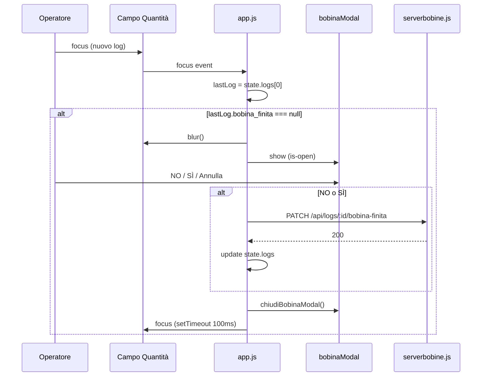

# Piano: Modale "La vecchia bobina è finita?"

## Contesto

- **Trigger**: focus sul campo "Quantità" (`#quantity`) quando si sta creando un **nuovo** log (nessun `state.selectedLog`).
- **Condizione**: esiste almeno un log e l’ultimo (primo in lista, ordinamento `Date DESC` dal backend) ha `bobina_finita === null`.
- **Comportamento**: bloccare l’input (blur), aprire modale full-screen con due metà (NO rosso, SÌ blu) e pulsante grigio "Annulla / Esci"; alla risposta inviare PATCH e aggiornare lo state locale.

---

## 1. Backend – [serverbobine.js](c:\Users\depel\Documents\progetto\ujet\bobine\serverbobine.js)

**A. Includere `bobina_finita` nelle SELECT**

- **GET /api/logs** (query che inizia a riga 108): nella SELECT, dopo `L.NumeroModifiche` (riga 121), aggiungere:
  - `, L.bobina_finita`
- **GET /api/logs/:id** (query che inizia a riga 141): nella SELECT, dopo `L.NumeroModifiche` (riga 154), aggiungere:
  - `, L.bobina_finita`

**B. Nuovo endpoint PATCH**

- Inserire **prima** di `const PORT = 3000;` (prima di riga 277) il blocco:

```javascript
app.patch('/api/logs/:id/bobina-finita', async (req, res) => {
    const id = parseInt(req.params.id, 10);
    const { bobina_finita } = req.body; // true = 1 (Sì), false = 0 (No)
    try {
        let pool = await sql.connect(dbConfig);
        await pool.request()
            .input('IDLog', sql.Int, id)
            .input('BobinaFinita', sql.Bit, bobina_finita)
            .query(`UPDATE [CMP].[dbo].[Log] SET bobina_finita = @BobinaFinita WHERE IDLog = @IDLog`);
        res.status(200).send({ message: 'Stato bobina aggiornato' });
    } catch (err) {
        res.status(500).send(err.message);
    }
});
```

**Nota**: La tabella `[CMP].[dbo].[Log]` deve avere la colonna `bobina_finita` (tipo `BIT` o compatibile). Se non esiste, va aggiunta con uno script SQL (fuori dallo scope di questo piano).

---

## 2. Frontend – HTML – [index.html](c:\Users\depel\Documents\progetto\ujet\bobine\index.html)

- Aggiungere il markup del modale **in fondo al `<body>`**, **prima** dei tag `<script>` (quindi dopo la chiusura di `</div>` del modale "Storico Modifiche", prima di `<script src="https://...">` a riga 166):

```html
    <div class="scanner-modal" id="bobinaModal" aria-hidden="true">
      <div class="bobina-modal-inner">
        <h2 class="bobina-title">La vecchia bobina è finita?</h2>
        <div class="bobina-split">
          <button type="button" class="bobina-btn bobina-no" id="bobinaBtnNo">NO</button>
          <button type="button" class="bobina-btn bobina-yes" id="bobinaBtnYes">SÌ</button>
        </div>
        <button type="button" class="bobina-cancel" id="bobinaBtnCancel">Annulla / Esci</button>
      </div>
    </div>
```

- Il modale riusa la classe `.scanner-modal` (e `.is-open`) già usata per scanner e storico, quindi visibilità e overlay sono coerenti.

---

## 3. Frontend – CSS – [styles.css](c:\Users\depel\Documents\progetto\ujet\bobine\styles.css)

- Aggiungere **in fondo al file** (dopo l’ultimo blocco, che termina circa a riga 901) i selettori per il modale bobina:
  - `#bobinaModal .bobina-modal-inner`: full viewport, flex colonna, senza border-radius/padding.
  - `.bobina-title`: titolo centrato, padding, `var(--text)` e `var(--bg)`.
  - `.bobina-split`: `display: flex`, `flex: 1`, contenitore delle due metà.
  - `.bobina-btn`: metà sinistra/destra, font grande, `.bobina-no` con `var(--danger)` (rosso), `.bobina-yes` con `var(--line)` (blu).
  - `.bobina-cancel`: altezza 70px, sfondo `#888888`, testo bianco.

(Testo esatto delle regole come da specifica fornita dall’utente.)

---

## 4. Frontend – JS – [app.js](c:\Users\depel\Documents\progetto\ujet\bobine\app.js)

- Inserire il blocco di logica **subito prima** della chiamata `initApp();` (riga 1147), quindi dopo la chiusura dell’ultimo blocco (es. dopo riga 1145).

Contenuto del blocco:

1. **Variabile**: `let pendingBobinaLogId = null;`
2. **Listener su `#quantity`**: in `focus`:
  - Se `!state.selectedLog` e `state.logs && state.logs.length > 0`:
    - `lastLog = state.logs[0]` (ultimo inserito, lista già ordinata dal backend per data DESC).
    - Se `lastLog.bobina_finita === null`: `e.target.blur()`, `pendingBobinaLogId = lastLog.uniqueRecordId`, aprire `#bobinaModal` (aggiungere `.is-open`, `aria-hidden="false"`).
3. `**chiudiBobinaModal()**`: rimuovere `.is-open`, `aria-hidden="true"`, azzerare `pendingBobinaLogId`, dopo 100 ms fare `focus` su `#quantity` se presente.
4. `**impostaStatoBobina(isFinita)**`: se non c’è `pendingBobinaLogId` chiamare `chiudiBobinaModal()` e uscire; altrimenti:
  - `PATCH` a `${API_URL}/logs/${pendingBobinaLogId}/bobina-finita` con body `{ bobina_finita: isFinita }`;
  - in caso successo: aggiornare nello state il log con `uniqueRecordId === pendingBobinaLogId` impostando `bobina_finita = isFinita`, poi `chiudiBobinaModal()`;
  - in caso errore: `alert` con messaggio e `chiudiBobinaModal()`.
5. **Eventi sui pulsanti**: `bobinaBtnYes` → `impostaStatoBobina(true)`, `bobinaBtnNo` → `impostaStatoBobina(false)`, `bobinaBtnCancel` → `chiudiBobinaModal`.

**Nota**: Se in futuro si riscontrassero mismatch di tipo su `uniqueRecordId` (numero vs stringa), si può usare confronto con `Number()` o `==` in `find`.

---

## Flusso riassuntivo




---

## File da modificare (riepilogo)


| File                                                                             | Modifiche                                                                                                                                                     |
| -------------------------------------------------------------------------------- | ------------------------------------------------------------------------------------------------------------------------------------------------------------- |
| [serverbobine.js](c:\Users\depel\Documents\progetto\ujet\bobine\serverbobine.js) | Aggiungere `, L.bobina_finita` in entrambe le SELECT; inserire endpoint `PATCH /api/logs/:id/bobina-finita` prima di `app.listen`.                            |
| [index.html](c:\Users\depel\Documents\progetto\ujet\bobine\index.html)           | Inserire il markup del modale `#bobinaModal` prima degli `<script>`.                                                                                          |
| [styles.css](c:\Users\depel\Documents\progetto\ujet\bobine\styles.css)           | Aggiungere in coda gli stili per `.bobina-modal-inner`, `.bobina-title`, `.bobina-split`, `.bobina-btn`, `.bobina-no`, `.bobina-yes`, `.bobina-cancel`.       |
| [app.js](c:\Users\depel\Documents\progetto\ujet\bobine\app.js)                   | Aggiungere variabile, listener su `#quantity`, `chiudiBobinaModal`, `impostaStatoBobina` e binding dei tre pulsanti del modale, subito prima di `initApp();`. |


---

## Verifica post-implementazione

- Con ultimo log con `bobina_finita = null`: focus su Quantità (nuovo log) apre il modale; NO/SÌ inviano PATCH e aggiornano lo state; Annulla chiude senza PATCH.
- Con ultimo log con `bobina_finita` già valorizzato (true/false): focus su Quantità non apre il modale.
- In modifica log esistente (`state.selectedLog` valorizzato): focus su Quantità non apre il modale.

