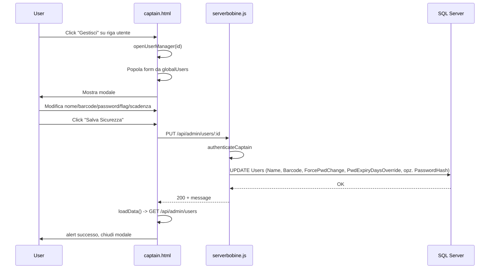

# Pannello di Gestione Utente - Captain Console (Passaporto)

Piano in 3 task sequenziali: struttura UI del modale, logica frontend (tab, apertura, salvataggio), backend PUT e estensione GET.

---

## Contesto attuale

- **[captain.html](c:\Users\depel\Documents\progetto\ujet\bobine\captain.html)**: griglia utenti in `renderUsersTable()` con bottone "Gestisci Accessi" (riga 159) senza `onclick`; modale `adminUserModal` per nuovo utente; pattern modale = `classList.add/remove('is-open')` + `aria-hidden`.
- **[serverbobine.js](c:\Users\depel\Documents\progetto\ujet\bobine\serverbobine.js)**: GET `/api/admin/users` (righe 227-245) restituisce già `forcePwdChange` e `lastPasswordChange`; **manca** `PwdExpiryDaysOverride` → `pwdExpiryDaysOverride`. **Non esiste** PUT `/api/admin/users/:id`.

---

## TASK 1: Struttura UI del Pannello (captain.html)

**1.1 Inserire il modale HTML**  
Posizione: subito prima della chiusura di `</body>` (dopo il modale `adminUserModal` e prima del tag `<script>`), quindi dopo la riga 67 (fine di `adminUserModal`).

- Aggiungere il blocco completo fornito dall’utente: contenitore `#userManagePanel` con classe `scanner-modal`, header (titolo nome utente, barcode, bottone Chiudi), sidebar con 3 tab (Sicurezza, Sessioni, Accessi), area contenuto con tre sezioni `#ump-sec`, `#ump-ses`, `#ump-acc`. La sezione Sicurezza contiene: campo hidden `umpUserId`, campi Nome/Barcode, box “Gestione Password” (input password, checkbox “Forza reset”, number “Scadenza giorni”), bottone “Salva Sicurezza”.

**1.2 Stili per i tab**  

- Aggiungere in [captain.html](c:\Users\depel\Documents\progetto\ujet\bobine\captain.html) un blocco `<style>` (o in [captain.css](c:\Users\depel\Documents\progetto\ujet\bobine\captain.css)) con:

```css
.ump-tab.active {
  background: var(--bg-content);
  border-left: 4px solid var(--primary);
}
```

Così il tab attivo (Sicurezza) si distingue visivamente. Le altre classi/inline già presenti nel markup sono sufficienti.

**Risultato**: modale a tutto schermo (800px, 80vh) con 3 tab; solo la prima area ha contenuto compilabile; le altre due mostrano placeholder “Funzionalità in arrivo”.

---

## TASK 2: Logica Frontend (captain.html)

**2.1 Cambio tab**  

- Dopo il markup del modale (o all’interno dello stesso `<script>` esistente), aggiungere un listener su `document` (event delegation) oppure su un contenitore che non viene sostituito da `innerHTML` — **nota**: `#userManagePanel` non è dentro `#view-utenti`, quindi non viene ri-renderizzato. Si può quindi fare un solo `document.querySelectorAll('.ump-tab')` e su ciascun bottone `click`:  
  - Rimuovere la classe `active` da tutti i `.ump-tab`.  
  - Aggiungere `active` al tab cliccato.  
  - Nascondere tutte le `.ump-content-section` (es. `style.display = 'none'`).  
  - Mostrare la sezione il cui `id` coincide con l’attributo `data-tab` del bottone (es. `ump-sec`, `ump-ses`, `ump-acc`).

**2.2 Bottone “Gestisci” in griglia**  

- In `renderUsersTable()`, nella riga che costruisce le azioni (circa 158-160), sostituire il bottone “Gestisci Accessi” con:

```html
<button onclick="openUserManager(${u.id})" class="action-btn">Gestisci</button>
```

In questo modo `openUserManager` deve essere definita in ambito globale (window) o comunque visibile al momento del click.

**2.3 Funzione `openUserManager(id)`**  

- Cercare l’utente in `globalUsers` con `const u = globalUsers.find(u => u.id === id)`. Se non trovato, uscire (es. `return`).  
- Popolare:  
  - `umpUserName` (header): `u.name`  
  - `umpUserBarcode` (header): `u.barcode`  
  - `umpUserId` (hidden): `u.id`  
  - `umpInputName`: `u.name`  
  - `umpInputBarcode`: `u.barcode`  
  - `umpForcePwdChange`: `u.forcePwdChange` (boolean)  
  - `umpPwdExpiry`: `u.pwdExpiryDaysOverride != null ? u.pwdExpiryDaysOverride : ''`  
  - `umpInputPwd`: lasciare vuoto (sempre, per non precompilare la password).
- Ripristinare la scheda attiva sulla prima (Sicurezza): mostrare solo `#ump-sec`, nascondere le altre, impostare `active` solo sul primo tab.  
- Mostrare il modale: `userManagePanel.classList.add('is-open')`, `userManagePanel.setAttribute('aria-hidden', 'false')`.

**2.4 Chiusura modale**  

- Listener su `#umpCloseBtn`: rimuovere `is-open`, impostare `aria-hidden="true"`.

**2.5 Salvataggio Sicurezza**  

- Listener su `#umpSaveSecBtn`:  
  - Leggere `id` da `umpUserId`, `name` da `umpInputName`, `barcode` da `umpInputBarcode`, `password` da `umpInputPwd` (trim), `forcePwdChange` da checkbox `umpForcePwdChange`, `pwdExpiryDaysOverride` da `umpPwdExpiry` (numero o null se vuoto).  
  - `fetch` **PUT** `/api/admin/users/${id}` con `credentials: 'include'`, header `Content-Type: application/json`, body:  
  `JSON.stringify({ name, barcode, password: password || undefined, forcePwdChange: forcePwdChange, pwdExpiryDaysOverride: pwdExpiryDaysOverride === '' ? null : parseInt(pwdExpiryDaysOverride, 10) })`.  
  - Se `res.ok`: chiamare `loadData()`, `alert('Impostazioni di sicurezza aggiornate con successo.')`, chiudere il modale. Altrimenti gestire errore (es. `res.text()` e alert).

Per coerenza con il resto della pagina si può usare `apiFetch` solo per GET (ritorna JSON); per il PUT con body e gestione messaggio di successo si può usare direttamente `fetch` e poi `loadData()` + chiusura modale, oppure estendere `apiFetch` per accettare opzioni e usare quella. In ogni caso il corpo della richiesta deve rispettare i nomi attesi dal backend: `name`, `barcode`, `password`, `forcePwdChange`, `pwdExpiryDaysOverride`.

---

## TASK 3: Backend API (serverbobine.js)

**3.1 Estendere GET `/api/admin/users`**  

- Nella query SELECT (righe 230-238), aggiungere il campo:  
`PwdExpiryDaysOverride as pwdExpiryDaysOverride`  
 così il frontend può popolare `umpPwdExpiry` e il salvataggio può inviare il valore corretto. `forcePwdChange` è già mappato in camelCase.

**3.2 Aggiungere PUT `/api/admin/users/:id`**  

- Nella sezione `// --- API ADMIN / CAPTAIN CONSOLE ---`, dopo GET e prima di GET modules (o in ordine logico dopo POST e prima di DELETE), inserire l’endpoint fornito dall’utente:
  - `app.put('/api/admin/users/:id', authenticateCaptain, async (req, res) => { ... })`.  
  - Parametro: `idUser = parseInt(req.params.id, 10)`.  
  - Body: `name`, `barcode`, `password`, `forcePwdChange`, `pwdExpiryDaysOverride`.  
  - Input SQL: `idUser`, `name`, `barcode`, `forcePwdChange` (Bit 0/1), `pwdExpiry` (Int, null se assente). Se `password` non vuoto: hash con `bcrypt.hash(password, 10)`, `request.input('pwd', sql.NVarChar, hash)` e `pwdQuery = ', PasswordHash = @pwd, LastPasswordChange = GETDATE()'`.  
  - Query: `UPDATE [CMP].[dbo].[Users] SET Name = @name, Barcode = @barcode, ForcePwdChange = @forcePwdChange, PwdExpiryDaysOverride = @pwdExpiry ${pwdQuery} WHERE IDUser = @idUser`.  
  - Risposta successo: `res.status(200).json({ message: 'Impostazioni di sicurezza aggiornate con successo.' })`.  
  - Catch: `console.error('Errore PUT /api/admin/users/:id:', err)`, `res.status(500).send(err.message)`.

Verificare che `bcrypt` sia già in uso nel file (sì, riga 7 e usato in POST users).

---

## Flusso end-to-end (Sicurezza)




---

## File da modificare (riepilogo)


| File                                                                             | Modifiche                                                                                                                                                                                                      |
| -------------------------------------------------------------------------------- | -------------------------------------------------------------------------------------------------------------------------------------------------------------------------------------------------------------- |
| [captain.html](c:\Users\depel\Documents\progetto\ujet\bobine\captain.html)       | (1) Modale HTML + CSS tab attivo prima di `</body>`. (2) Cambio tab, bottone Gestisci con `openUserManager(${u.id})`, `openUserManager(id)`, chiusura modale, salvataggio PUT e refresh.                       |
| [serverbobine.js](c:\Users\depel\Documents\progetto\ujet\bobine\serverbobine.js) | GET users: aggiungere `PwdExpiryDaysOverride as pwdExpiryDaysOverride`. Aggiungere PUT `/api/admin/users/:id` con logica sicurezza (name, barcode, password opzionale, forcePwdChange, pwdExpiryDaysOverride). |


Le aree "Sessioni (Radar)" e "Accessi (Visti)" restano solo con placeholder; la struttura tab e modale è pronta per implementazioni future.