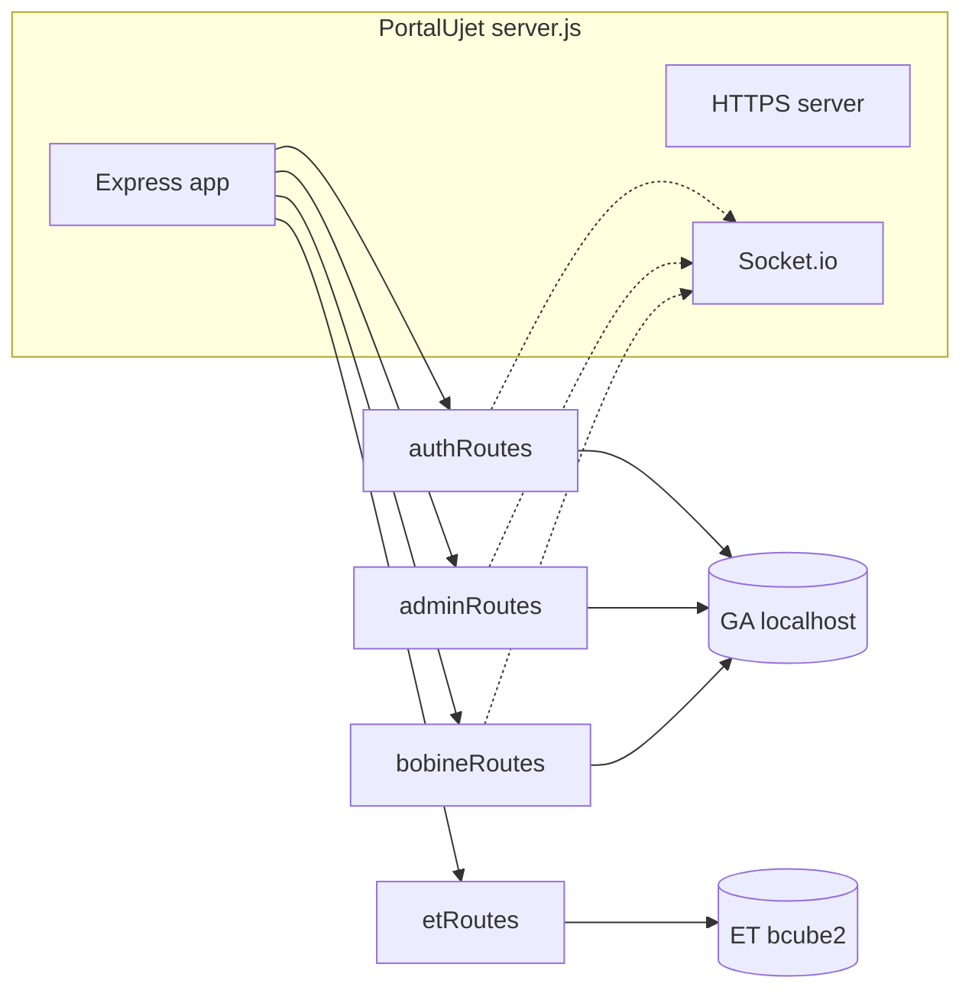

# Plan: PortalUjet + servidor modular + ET (bcube2)

## Contexto detectado en el código

- **[serverbobine.js](c:/Users/depel/Documents/progetto/ujet/bobine/serverbobine.js)** (~1358 líneas): `dbConfig` (GA en `localhost`), middleware JWT (`authenticateToken`, `authenticateCaptain`), helper `getEffectivePwdRules`, ~25 rutas bajo `/api` y `/api/admin`, luego bloque HTTPS + `socket.io` + `activeUserSockets`, ruta `POST /api/users/recover` que usa `io.emit`, y `io.on('connection')`.
- **Dependencias cruzadas con Socket.io / presencia** (no pueden quedar “sueltas” en routers sin inyección):
  - `io.emit('pwd_reset_resolved')` en **PUT** `/api/operators/:id/reset-password` ([L259-L260](c:/Users/depel/Documents/progetto/ujet/bobine/serverbobine.js)) y en **PUT** `/api/admin/users/:id` ([L416-L417](c:/Users/depel/Documents/progetto/ujet/bobine/serverbobine.js)).
  - `activeUserSockets.has(u.id)` en **GET** `/api/admin/users` ([L322](c:/Users/depel/Documents/progetto/ujet/bobine/serverbobine.js)).
  - `io.emit('pwd_reset_request', …)` en **POST** `/api/users/recover` ([L1288-L1293](c:/Users/depel/Documents/progetto/ujet/bobine/serverbobine.js)).
- **[ET.html](c:/Users/depel/Documents/progetto/ujet/bobine/ET.html)** ya llama a `/api/products`, `/api/components/...`, `/api/label`, `/api/etichette/salva` con `credentials: "include"`; no hace falta cambiar URLs si los routers se montan bajo `/api` como indicas.
- **[bobine.js](c:/Users/depel/Documents/progetto/ujet/bobine/bobine.js)** define `buildDynamicMenu()` que filtra `authorizedApps` (salta ids 1 y 2, enlace a ET id 3). En ET habrá que **excluir el id 3** y mapear el resto coherente con [captain.html](c:/Users/depel/Documents/progetto/ujet/bobine/captain.html) (p. ej. id 1 → `bobine.html`, id 3 → `ET.html`; ampliar el mapa si aparecen más módulos con URL fija).

## Riesgo técnico obligatorio: `authenticateToken` y `req.path`

Con `app.use('/api', router)`, en middlewares suele cumplirse `req.baseUrl === '/api'` y `req.path` relativo al router (p. ej. `/logout` en lugar de `/api/logout`). La “jaula” `forcePwdChange` hoy compara con rutas absolutas ([L88-L91](c:/Users/depel/Documents/progetto/ujet/bobine/serverbobine.js)) y **puede romperse** tras el refactor.

- **Acción**: calcular la ruta lógica con `(req.baseUrl || '') + req.path` (o equivalente robusto) y comparar con `/api/logout` y `/api/users/me/password` (y métodos si hace falta).

## Task 1: Renombrar y vaciar el servidor principal

1. Renombrar `serverbobine.js` → `server.js`.
2. En `server.js` dejar solo:
  - `express`, `express.json()`, `cors`, `cookie-parser`, `express.static(__dirname)`, `dotenv`.
  - Creación **HTTPS** (`sslOptions`, `https.createServer`, `PORT`, `listen`) como ahora ([L1241-L1257](c:/Users/depel/Documents/progetto/ujet/bobine/serverbobine.js)).
  - Instancia **Socket.io** + `activeUserSockets` + `io.on('connection', …)` (mismo comportamiento que [L1303-L1353](c:/Users/depel/Documents/progetto/ujet/bobine/serverbobine.js)).
  - **Sin** `app.get/post/...` inline: solo `app.use(...)` de routers.
3. **Orden recomendado** en `server.js`: crear `server` + `io` + `activeUserSockets` **antes** de registrar rutas que cierren sobre `io` / `activeUserSockets` (factory functions), para evitar depender del hoisting de `let io`.

### `config/db.js`

- Exportar `dbConfig` (GA, actualmente `localhost` / `GA`) tal como está hoy.
- Exportar `dbConfigET` con los valores que indicas (`server: 'bcube2'`, `database: 'ET'`, etc.).
- **Nota de seguridad**: las credenciales en código son frágiles; conviene leer `user`/`password`/`server` desde `.env` cuando implementes (sin bloquear el plan si el equipo prefiere fase 2).

### `middlewares/auth.js` (o el nombre que elijas)

- `JWT_SECRET` desde `process.env` (mismo check de error que hoy).
- Exportar `getEffectivePwdRules(pool, userId)` (mover cuerpo actual).
- Exportar `authenticateToken` y `authenticateCaptain`, importando `sql` solo donde haga falta para el helper si lo mantienes en el mismo archivo.
- Aplicar el arreglo de ruta para la jaula `forcePwdChange` descrito arriba.

## Task 2: `routes/authRoutes.js` (Passaporto)

- `express.Router()`.
- Rutas (paths **sin** prefijo `/api` porque montas con `app.use('/api', …)`):
  - `POST /login`, `POST /logout`, `GET /me`, `PUT /users/me/password`, `POST /users/recover`.
- Imports típicos: `sql`, `dbConfig`, `bcrypt`, `jwt`, `cookieParser` no hace falta en router; `getEffectivePwdRules`, `authenticateToken`.
- **Factory** `createAuthRoutes({ io })` (o parámetro único) para que `POST /users/recover` pueda hacer `io.emit('pwd_reset_request', …)` como ahora.

## Task 3: `routes/adminRoutes.js`

- Montaje: `app.use('/api/admin', adminRoutes)` → en el router las rutas son relativas: `GET /users`, `PUT /users/reorder`, `PUT /users/:id`, `PUT /users/:id/roles`, `GET /modules`, `PUT /modules/:id`, `GET /config`, `PUT /config`, `POST /users`, `DELETE /users/:id`, `GET /users/deleted`, `PUT /users/:id/restore`, `POST /users/check-duplicate`.
- **Factory** `createAdminRoutes({ io, activeUserSockets })` para:
  - `hasActiveSession` en `GET /users`.
  - `io.emit('pwd_reset_resolved')` en `PUT /users/:id` cuando corresponda.

## Task 4: `routes/bobineRoutes.js` (Visto Bobine)

- Mover operadores, máquinas y logs: todos los handlers que hoy están bajo `/api/operators`, `/api/machines`, `/api/logs` (incl. `PATCH /logs/:id/bobina-finita`, historial, etc.).
- **Factory** `createBobineRoutes({ io })` solo para `PUT /operators/:id/reset-password` que emite `pwd_reset_resolved`.
- Usar **solo** `dbConfig` (GA) como hasta ahora.

## Task 5: `routes/etRoutes.js` (ET / bcube2)

- Router que importa **exclusivamente** `dbConfigET` para `sql.connect(dbConfigET)` en cada handler (o pool dedicado si queréis optimizar en una segunda iteración).
- Implementar:
  - `GET /products`: `q` → `LIKE` sobre `[ET].[dbo].[Prodotti_Padre]` (misma forma de respuesta que espera ET: `{ products: string[] }` según el frontend actual).
  - `GET /components/:padre`: filtro `MD_coddb = :padre` en `[ET].[dbo].[Componenti_Figli]` → `{ components: [...] }` alineado con el uso de `MD_codfigli` en [ET.html](c:/Users/depel/Documents/progetto/ujet/bobine/ET.html).
  - `GET /label`: query params `et_kcodart`, `et_kcodart_layer` sobre `[ET].[dbo].[UJ_etichette3]`.
  - `POST /etichette/salva`: `authenticateToken`, cuerpo `CodicePadre`, `Descrizione`; auditoría con `req.user.globalId` hacia `[ET].[dbo].[sp_SalvaEtichetta]`.
- **Acción previa**: revisar en SQL Server la firma real de `sp_SalvaEtichetta` (nombres y tipos de parámetros). Ajustar `.input(...)` para que coincidan; si el SP no acepta aún el usuario de auditoría, acordar con DBA añadir el parámetro o usar un SP wrapper.

## Task 6: Enganchar routers en `server.js`

Montaje propuesto (orden: auth y admin primero ayuda a legibilidad; bobine y et comparten `/api` sin colisiones conocidas):

```js
app.use('/api', createAuthRoutes({ io }));
app.use('/api/admin', createAdminRoutes({ io, activeUserSockets }));
app.use('/api', createBobineRoutes({ io }));
app.use('/api', etRoutes);
```

- Si `etRoutes` es estático, exportar `router`; si necesitara dependencias en el futuro, usar la misma fábrica.

## Task 7: UI [ET.html](c:/Users/depel/Documents/progetto/ujet/bobine/ET.html)

- Añadir en cabecera el botón solicitado: `<button id="menuBtn" class="btn btn-outline-secondary">☰ Menu</button>` (integrado en un header/layout coherente con Bootstrap).
- Antes de `</body>`, markup del drawer como en [bobine.html](c:/Users/depel/Documents/progetto/ujet/bobine/bobine.html) (`#menuDrawer`, `#menuDrawerBackdrop`, `#menuDrawerClose`, `#dynamicMenuApps`, `#menuOpenCaptain`, acciones de perfil si las usáis en otras apps — al menos **logout**).
- Incluir `**bobine.css`** en el `<head>` para reutilizar clases `.menu-drawer`, `.menu-drawer-btn`, etc., y que el aspecto sea el mismo que Bobine.
- Script inline (o pequeño bloque al final):
  - Abrir/cerrar drawer (misma lógica que en bobine: backdrop, close, `menuBtn`).
  - Logout: `POST /api/logout` con `credentials: 'include'`, luego redirección/login según [sicurezza.js](c:/Users/depel/Documents/progetto/ujet/bobine/sicurezza.js) (reutilizar patrón de otras páginas si ya existe función global; si no, replicar fetch + `window.location`).
  - `buildDynamicMenu()`: leer `window.SecurityData.user.authorizedApps`, **omitir** app con `id === 3`, para cada otra app con URL conocida generar botones en `#dynamicMenuApps` (reutilizar mapa id → path como en captain/bobine).
  - Escuchar `securityReady` (y el fallback si `SecurityData` ya está cargado), igual que hace [bobine.js](c:/Users/depel/Documents/progetto/ujet/bobine/bobine.js).
  - Mostrar `#menuOpenCaptain` solo si `isSuperuser` (misma regla que en bobine).

## Diagrama de capas




## Seguimiento opcional (fuera del núcleo)

- Añadir script `"start": "node server.js"` en [package.json](c:/Users/depel/Documents/progetto/ujet/bobine/package.json) si arrancáis el servidor con npm.
- Documentación interna / runbooks que citen `serverbobine.js` (p. ej. bajo `.cursor/plans/`) no es obligatorio renombrarlas ahora.

