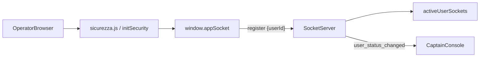

## Implementazione presenza real-time e icona Kick

### 1. Aggiornare `serverbobine.js` (motore di presenza in RAM)

- **1.1 Definire la mappa di stato in memoria**
  - Subito dopo l’inizializzazione di Socket.io in `[serverbobine.js](c:/Users/depel/Documents/progetto/ujet/bobine/serverbobine.js)` (dopo `const io = new Server(server, { ... })`), aggiungere:
    - `const activeUserSockets = new Map();` per tracciare `userId -> Set<socket.id>`.
- **1.2 Sostituire il blocco `io.on('connection', ...)`**
  - Rimuovere l’implementazione attuale (che usa le stanze `user_<id>` ed emette `force_logout` / `show_pwd_curtain`) e sostituirla con il blocco fornito:
    - All’interno di `io.on('connection', (socket) => { ... })`:
      - Dichiarare `let currentUserId = null;`.
      - Aggiungere handler `socket.on('register', (data) => { ... })` che si aspetta `{ userId }`, popola/aggiorna `activeUserSockets`, e quando un utente passa da offline a online emette in `captains_room` l’evento `user_status_changed` con `{ userId, isOnline: true }`.
      - Aggiungere handler `socket.on('register_captain', ...)` che fa `socket.join('captains_room');`.
      - Reintegrare gli eventi esistenti per sipario e kick come da snippet richiesto:
        - `force_pwd_curtain` → `io.emit('trigger_pwd_curtain', data);`
        - `kick_user` → `io.emit('trigger_kick', data);`
      - Gestire `socket.on('disconnect', ...)` aggiornando il `Set` relativo a `currentUserId`, eliminando la chiave se vuota e notificando i Captain con `user_status_changed` e `isOnline: false`.
  - Il nuovo blocco diventa l’unico gestore di connessione Socket.io sul server.
- **1.3 Iniettare `hasActiveSession` in `/api/admin/users` usando la RAM**
  - Nella rotta `app.get('/api/admin/users', ...)` in `[serverbobine.js](c:/Users/depel/Documents/progetto/ujet/bobine/serverbobine.js)`:
    - Attualmente, nel ciclo che inizializza gli utenti (righe 260–266), `u.hasActiveSession` è forzato a `true` per test.
    - Sostituire quell’assegnazione con una basata sulla mappa in RAM:
      - Per ogni `u` dell’array `users`, impostare `u.hasActiveSession = activeUserSockets.has(u.id);` (in questo endpoint `id` è l’`IDUser` logico globale, quindi non servono alias).
    - Non aggiungere nuove query o colonne DB: lo stato deve riflettere *solo* `activeUserSockets`.

### 2. Aggiornare `sicurezza.js` per emettere lo stato di presenza

- **2.1 Posizionare correttamente `window.SecurityData`**
  - In `[sicurezza.js](c:/Users/depel/Documents/progetto/ujet/bobine/sicurezza.js)`, dentro `initSecurity()`:
    - Dopo aver determinato `const user = data.user || data;` assicurarsi che `window.SecurityData = { user };` sia eseguito prima di inizializzare la logica Socket.io (per poter usare `window.SecurityData.user.globalId`).
- **2.2 Aggiungere la timbratura di presenza**
  - Subito dopo l’assegnazione di `window.SecurityData.user` (o `window.SecurityData = { user }`), inserire esattamente il blocco richiesto:
    - Se `typeof io !== 'undefined'` e `window.SecurityData.user` esiste:
      - Creare, se assente, `window.appSocket = io();`.
      - Chiamare `window.appSocket.emit('register', { userId: window.SecurityData.user.globalId });`.
- **2.3 Allineare la sicurezza real-time con il nuovo socket (facoltativo ma consigliato)**
  - Modificare la sezione "REAL-TIME SECURITY (WEBSOCKETS)" affinché riutilizzi `window.appSocket` invece di creare un nuovo `const socket = io();`:
    - Se `window.appSocket` esiste, usare quello per registrare i listener `force_logout` e `show_pwd_curtain`.
    - In questo modo si evita una doppia connessione per lo stesso utente mantenendo inalterato il comportamento funzionale già in uso.

### 3. Aggiornare `captain.html` (UI, Kick e listener real-time)

- **3.1 Sostituire il rendering della colonna “Stato Sessione”**
  - In `[captain.html](c:/Users/depel/Documents/progetto/ujet/bobine/captain.html)`, dentro `renderUsersTable()`:
    - Individuare il blocco dove viene calcolato `statoHtml` all’interno del `forEach(u => { ... })` (righe 407–424 attuali), che costruisce il dot + testo e il bottone con emoji "🦵".
    - Sostituire l’intera logica di calcolo di `statoHtml` con il markup fornito:
      - Calcolare `safeName` una volta usando `const safeName = (u.name || '').replace(/\\/g, '\\\\').replace(/'/g, "\\'");`.
      - Impostare `statoHtml` su il layout flessibile che:
        - Wrappa tutto in `#status-container-${u.id}`.
        - Mostra a sinistra il bottone Kick con immagine `images/kick.png`, id `kick-btn-${u.id}`, `onclick="kickUser(${u.id}, '${safeName}')"` e visibilità legata a `u.hasActiveSession`.
        - A destra mostra il dot (`#status-dot-${u.id}`) e il testo (`#status-text-${u.id}`) con colori/titoli e font che dipendono da `u.hasActiveSession` (`var(--success)` per online, `var(--border)`/`var(--text-muted)` per offline).
      - Lasciare inalterata la funzione `kickUser` già definita più in basso, che continuerà a emettere `kick_user` via Socket.io.
- **3.2 Inizializzare Socket.io per i Captain e ascoltare `user_status_changed`**
  - Nella funzione `initCaptainConsole()` in `[captain.html](c:/Users/depel/Documents/progetto/ujet/bobine/captain.html)` (dopo il punto 3, cioè dopo aver costruito l’App Switcher):
    - Aggiungere il blocco:
      - Verifica `if (typeof io !== 'undefined') { ... }`.
      - Se `!captainSocket`, istanziare `captainSocket = io();` una sola volta.
      - Emettere `captainSocket.emit('register_captain');` per iscrivere la console nella stanza `captains_room`.
      - Registrare il listener `captainSocket.on('user_status_changed', (data) => { ... })` che:
        - Estrae `{ userId, isOnline }`.
        - Trova l’utente in `globalUsers` con `u.id === userId` e aggiorna `user.hasActiveSession = isOnline;`.
        - Aggiorna il DOM in-place:
          - `#status-dot-${userId}`: `backgroundColor`, `title`.
          - `#status-text-${userId}`: `fontWeight`, `color`, `textContent`.
          - `#kick-btn-${userId}`: `display` "flex" se `isOnline`, "none" se offline.
    - Questo blocco si integra con l’uso esistente di `captainSocket` in `kickUser` e `umpForcePwdNowBtn`, che continueranno a funzionare usando la stessa connessione Socket.io.

### 4. Verifica di coerenza e flusso finale

- **4.1 Flusso operatore (Bobine & altre app)**
  - All’avvio di una pagina protetta, `initSecurity()` chiama `/api/me`, popola `window.SecurityData.user` e:
    - Inizializza `window.appSocket` se presente Socket.io.
    - Emette `register` verso il server con `{ userId: globalId }` per segnalare la presenza.
- **4.2 Flusso Captain Console**
  - All’avvio di `captain.html`, `initCaptainConsole()` verifica che l’utente sia Captain, carica gli utenti via `/api/admin/users` (con `hasActiveSession` calcolato su `activeUserSockets`) e renderizza la tabella con il nuovo layout Kick + dot.
  - La console apre una sola connessione Socket.io (`captainSocket`), si registra nella stanza `captains_room` e riceve `user_status_changed` in tempo reale, aggiornando DOM e stato interno senza ricaricare la tabella.
- **4.3 Kick & Sipario**
  - Confermare che gli eventi `kick_user` e `force_pwd_curtain` dal Captain continuino a essere emessi come ora, ma ora il server li rilancia nel formato richiesto (`trigger_kick`, `trigger_pwd_curtain`) verso i client interessati (come già gestito a livello applicativo).
  - Verificare, con test manuali, che:
    - Kick da Captain chiuda effettivamente la sessione lato operatore.
    - Il Sipario di sicurezza venga ancora mostrato correttamente quando forzato.

