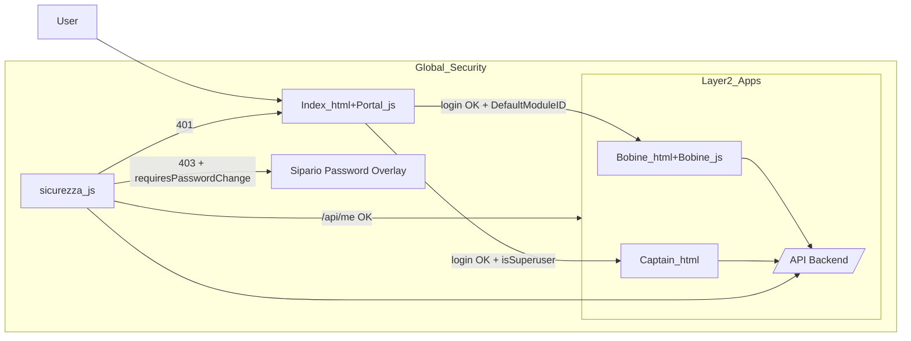

## Refactoring Meta-App Bobine: piano ad alta affidabilità

### 1. Aggiornamento documentazione (`conoscenze.txt`)

- **File**: `[conoscenze.txt](c:/Users/depel/Documents/progetto/ujet/bobine/conoscenze.txt)`
- **Azioni**:
  - Aggiungere in coda al file la nuova sezione **"4. ARCHITETTURA META-APP"** con il testo fornito nella richiesta.
  - Lasciare intatta la sezione esistente `## ARCHITETTURA META-APP` (nessuna rimozione, solo aggiunta), così da avere sia la descrizione attuale sia la nuova sezione numerata orientata ai layer.

### 2. Trasloco fisico dei file (Layer 2 Bobine)

- **File coinvolti**:
  - `[index.html](c:/Users/depel/Documents/progetto/ujet/bobine/index.html)` (diventerà `bobine.html`)
  - `[app.js](c:/Users/depel/Documents/progetto/ujet/bobine/app.js)` (diventerà `bobine.js`)
- **Azioni**:
  - Rinominare `index.html` in `bobine.html` mantenendo integralmente la struttura HTML vista ora (menu laterale, modali, ecc.).
  - Rinominare `app.js` in `bobine.js` senza alterare il codice in questa fase.
  - Aprire il nuovo `bobine.html` e, in fondo al `<body>`, aggiornare:
    - Da: `<script src="app.js"></script>`
    - A: `<script src="bobine.js"></script>`
  - Verificare che il resto dei riferimenti (ad es. `beep.mp3`, `manifest.json`, CDN Html5Qrcode) restino invariati.

### 3. Creazione del Layer 1 (Gateway: `index.html` + `portal.js`)

#### 3.1 Nuovo `index.html` minimale ma completo

- **File**: creare `[index.html](c:/Users/depel/Documents/progetto/ujet/bobine/index.html)` ex novo.
- **Struttura**:
  - `<!doctype html>`, `<html lang="it">`, `<head>` con:
    - `<meta charset="UTF-8">`, viewport, title (es. "UJet Gateway"), favicon se serve.
    - Inclusione del CSS principale: usare il foglio già esistente `styles.css` (o rinominare in `style.css` in futuro se decidi di uniformare):
      - `<link rel="stylesheet" href="styles.css">`.
  - `<body>` minimalista che contiene solo:
    - Il markup del **login** e del **profilo** (vedi passo 3.2).
    - Eventuale wrapper/`<main>` centrato per una UX pulita (login form centrato in viewport).
    - `<script src="portal.js"></script>` alla fine del body.

#### 3.2 Spostamento dei modali Login e Profilo nel Gateway

- **Sorgente**: `bobine.html` (ex `index.html`).
  - Blocchi da tagliare:
    - `#loginModal` (div con class `scanner-modal` + inner, da riga ~216 a ~239 nel file attuale).
    - `#profileModal` (div con class `scanner-modal` + inner, da riga ~241 a ~279).
- **Azioni**:
  - TAGLIARE questi due blocchi da `bobine.html` e INCOLLARLI nel `<body>` del nuovo `index.html`.
  - Adattare il layout affinché il **login sia sempre visibile** al centro pagina:
    - Rimuovere/ignorare la semantica "modal nascosto" per il login:
      - Rimuovere `aria-hidden="true"` e classi tipo `scanner-modal` usate per hiding, oppure
      - Applicare una variante CSS nella nuova pagina che mantenga il wrapper visibile in modo permanente.
    - Posizionare il contenitore login (quello con titolo "Login operatore") al centro con flexbox (es. `body { display:flex; justify-content:center; align-items:center; min-height:100vh; }`).
  - Il `profileModal` può rimanere come vero modale (chiuso di default) nella pagina Gateway, perché viene aperto solo in caso di `forcePwdChange`.

#### 3.3 Nuovo `portal.js` e migrazione di `performLogin`

- **File**: creare `[portal.js](c:/Users/depel/Documents/progetto/ujet/bobine/portal.js)`.
- **Contenuti**:
  - Copiare dalla vecchia `performLogin` presente in `app.js` (che diventerà `bobine.js`) tutta la logica di:
    - Lettura valori da `#loginBarcode` e `#loginPassword`.
    - Chiamata `fetch(`${API_URL}/login`, { ... })` con `credentials: 'include'`.
    - Gestione dei casi 401 con `requiresPassword` e messaggi errore (mostra campo password, messaggi in `#loginMessage`).
  - Ricollegare gli event listener del login (`loginSubmitBtn`, tasto Enter, scan barcode) all'interno di `portal.js` usando gli stessi ID ora presenti in `index.html`.
  - **Modificare SOLO la gestione del caso di successo (HTTP 200)** sostituendo completamente la parte finale con la logica richiesta:

```javascript
// Dopo `const data = await res.json();` dentro `performLogin` in portal.js
if (data.user.forcePwdChange) {
    document.getElementById('profileModal').classList.add('is-open');
    document.getElementById('profileCloseBtn').style.display = 'none';
    document.getElementById('profilePwdMsg').textContent = '⚠️ Cambio password obbligatorio.';
    return;
}

if (data.user.defaultModuleId) {
    window.location.href = '/bobine.html';
} else if (data.user.isSuperuser) {
    window.location.href = '/captain.html';
} else {
    alert('Nessuna app predefinita. Contatta il Captain.');
}
```

- **Nota routing**:
  - Assumiamo che `bobine.html` e `captain.html` siano serviti alla root (`/bobine.html`, `/captain.html`). Se il server li serve da path diversi, adatteremo questi URL in fase di implementazione mantenendo la stessa logica.

### 4. Creazione del Guardiano globale (`sicurezza.js`)

#### 4.1 Nuovo file `sicurezza.js`

- **File**: creare `[sicurezza.js](c:/Users/depel/Documents/progetto/ujet/bobine/sicurezza.js)`.
- **Contenuto**: incollare **esattamente** il codice fornito nella richiesta (inizializzazione `window.SecurityData`, `initSecurity()`, `showPasswordCurtain()` con overlay e PUT su `/api/users/me/password`, ed esecuzione immediata `initSecurity();`).

#### 4.2 Collegamento a `bobine.html` e `captain.html`

- **bobine.html**:
  - Nel `<head>` di `bobine.html` (ex `index.html`), prima di ogni script specifico dell'app (attualmente solo `<script src="https://cdn.jsdelivr.net/...html5-qrcode..."></script>` che resterà in fondo al body):
    - Aggiungere `<script src="sicurezza.js"></script>`.
  - Verificare che nessun altro script di sicurezza globale venga caricato qui per evitare duplicati.
- **captain.html**:
  - Nel `<head>` di `[captain.html](c:/Users/depel/Documents/progetto/ujet/bobine/captain.html)`, aggiungere:
    - `<script src="sicurezza.js"></script>` prima di altri script (tutta la logica attuale è in uno `<script>` inline in fondo al body, quindi non ci sono conflitti di ordine).
- **Flusso di controllo atteso**:
  - All'apertura di una pagina di Layer 2 (bobine/captain), `sicurezza.js` esegue subito `initSecurity()`:
    - `GET /api/me`.
    - `401` → redirect immediato a `'/'` (Gateway).
    - `403` con `requiresPasswordChange` → iniezione Sipario overlay + blocco dell'app sottostante, senza reload.
    - `200` → popolamento `window.SecurityData = data` + `document.dispatchEvent(new Event('securityReady'))` come segnale di via libera.

### 5. Pulizia ed evoluzione del Layer 2 (`bobine.js`)

#### 5.1 Rimozione logica di autenticazione locale

- **File**: `[bobine.js](c:/Users/depel/Documents/progetto/ujet/bobine/bobine.js)` (ex `app.js`).
- **Funzioni da eliminare o disaccoppiare** (senza toccare ancora il resto della business logic):
  - `performLogin` (attualmente righe ~427–490): verrà completamente rimossa da `bobine.js` perché ora vive in `portal.js`.
  - `openProfileModal`, `closeProfileModal`, `openLoginModal`, `closeLoginModal` e qualsiasi funzione/event handler usato solo per login, logout e cambio password.
  - Event listener di `logoutBtn` che invoca `/api/logout` e richiama `handleAuthError` (righe ~1662–1673): questa logica di logout esplicito sarà spostata o reimplementata eventualmente a livello Gateway.
  - Il gestore `profileSavePwdBtn` che fa PUT su `/users/me/password` (righe ~1730–1802): ora questa responsabilità viene coperta dal Sipario in `sicurezza.js` e, lato Gateway, dal modale profilo.
- **Attenzione**:
  - Prima di rimuovere qualsiasi funzione, verificare mediante ricerca (`performLogin`, `openProfileModal`, `loginModal`, `logoutBtn`) di non lasciare riferimenti orfani. In caso di riferimenti da UI che devono ancora esistere in Bobine, si valuterà se:
    - eliminare anche il relativo markup, **oppure**
    - farli puntare a nuove funzioni di navigazione verso il Gateway.

#### 5.2 Nuova inizializzazione basata su `securityReady`

- **Punto attuale**: `initApp()` (righe ~263–291) chiama `/api/me` e decide se aprire il `loginModal` o caricare i dati.
- **Modifica**:
  - Svuotare `initApp()` o ridurlo a un semplice setup UI (schermate, eventi, ecc.) **senza più chiamare `/api/me` o mostrare modali di login**.
  - Aggiungere l'handler globale per l'evento `securityReady` (alla fine del file, prima di `initApp();` o subito dopo le variabili globali):

```javascript
document.addEventListener('securityReady', async () => {
    const user = window.SecurityData.user;

    const menuContainer = document.getElementById('sidebarMenuContainer');
    if (user.isSuperuser) {
        if (!document.getElementById('btnGoCaptain')) {
            const btn = document.createElement('button');
            btn.id = 'btnGoCaptain';
            btn.className = 'menu-item';
            btn.innerHTML = '⚙️ Captain Console';
            btn.onclick = () => window.location.href = '/captain.html';

            // Adattamento all'HTML Bobine: possiamo inserirlo nel drawer di menu esistente
            const sidebar = menuContainer || document.querySelector('.menu-drawer-actions');
            if (sidebar) sidebar.appendChild(btn);
        }
    }

    await loadInitialData();
});
```

- Assicurarsi che `loadInitialData()` non faccia più controlli su login/modal (già così, ora usa solo `fetchData`).
- Lasciare `initApp();` alla fine del file, ma ridotto a:
  - setup iniziale schermi,
  - eventuale preload minimo,
  - **nessuna** chiamata a `/api/me`.

#### 5.3 Allineamento con `sicurezza.js` per futuri 401/403

- **Opzionale ma consigliato (secondo step evolutivo)**:
  - Valutare di semplificare `fetchData()` (righe ~207–235) per:
    - In caso di 401/403:
      - Non aprire più modali di login locali (`openLoginModal`), ma:
      - delegare a `window.location.href = '/'` oppure a una funzione helper globale di sicurezza.
  - Questo step può essere fatto in un secondo momento; il piano attuale si limita a:
    - scollegare completamente il login operativo dal Layer 2,
    - rendere il caricamento dati dipendente da `securityReady`.

### 6. Aggiornamenti su `captain.html` (minimi)

- **File**: `captain.html`.
- **Azioni**:
  - Assicurarsi che tutti i redirect di sicurezza interna puntino al nuovo Gateway (`index.html`):
    - Nel `script` inline, esiste già in `apiFetch` la logica:
      - `window.location.href = 'index.html';` in caso di 401/403 → ciò diventa coerente con il nuovo Layer 1.
  - Dopo l’introduzione di `sicurezza.js`, verificare che il flusso sia:
    - Apertura `captain.html` → `sicurezza.js` controlla `/api/me`.
    - Se ok → `securityReady` (anche se la console già fa `apiFetch('/me')` e controlla `isSuperuser` → doppio ma coerente).
    - Se non ok → redirect al Gateway, senza necessità di altre UI locali di login.

### 7. Schema architetturale (per documentazione)




### TODO operativi

- **step-doc**: Aggiungere la sezione 4 in `conoscenze.txt` con il testo fornito.
- **step-rename**: Rinominare `index.html`→`bobine.html` e `app.js`→`bobine.js` aggiornando il riferimento dello script.
- **step-gateway**: Creare il nuovo `index.html` (Gateway) e spostare i modali login/profilo dentro di esso con layout centrato.
- **step-portaljs**: Creare `portal.js` e migrare `performLogin` con la nuova logica di routing e gestione `forcePwdChange`.
- **step-sicurezza**: Creare `sicurezza.js` con il Sipario e linkarlo in `bobine.html` e `captain.html`.
- **step-bobine-init**: Ripulire `bobine.js` dalla logica di auth/login/profilo/logout e collegare l’inizializzazione ai segnali `securityReady`/`window.SecurityData`.
- **step-verifica**: Testare end‑to‑end i flussi: login normale con DefaultModuleID, login Superuser verso Captain, caso `forcePwdChange` al login, caso 401/403 con Sipario in una pagina di Layer 2.

