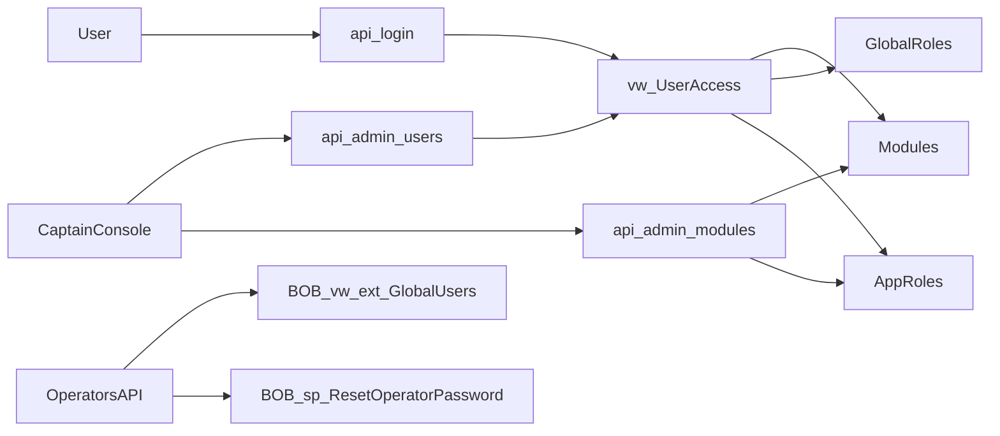

### Obiettivi principali

- **Backend (`serverbobine.js`)**: usare la vista federata `[GA].[dbo].[vw_UserAccess]` e le tabelle `GlobalRoles`/`AppRoles` per calcolare moduli e ruoli, eliminando completamente l’uso di `RoleDefinition` JSON e i cicli hardcodati sulle tabelle di reparto.
- **Frontend (`captain.html`)**: adeguare la Captain Console al nuovo payload, che espone `mod.roles` (array) invece di `mod.roleDefinition` (oggetto JSON), e limitare il salvataggio nel modale moduli ai soli `appSettings`.
- **Incapsulamento**: garantire che le rotte operatori Bobine usino solo viste/stored locali autorizzate (`[BOB].[dbo].[vw_ext_GlobalUsers]`, `[BOB].[dbo].[sp_ResetOperatorPassword]`) senza query dirette a `[GA]` per logiche di reparto.

### Passi dettagliati

#### 1. Refactor POST `/api/login`

- **1.1 Identificare il blocco attuale** che calcola `authorizedApps` e `globalRequiresPassword` nel handler `app.post('/api/login', ...)`, che oggi:
  - Esegue una query su `[GA].[dbo].[Modules]` con `RoleDefinition`.
  - Cicla con `for (let mod of modulesRes.recordset)`.
  - Determina l’accesso leggendo tabelle come `[BOB].[dbo].[Operators]` o `[CAP].[dbo].[Captains]` in base a `TargetTable`.
  - Effettua il parse del JSON `mod.RoleDefinition` per ottenere `roleLabel` e `requiresPassword`.
- **1.2 Sostituire completamente quel blocco** con la query contro la vista federata fornita:
  - Eseguire la query su `[GA].[dbo].[vw_UserAccess]` joinata con `Modules`, `GlobalRoles`, `AppRoles` usando l’`IDUser` loggato.
  - Assegnare `const authorizedApps = accessRes.recordset;`.
  - Calcolare `globalRequiresPassword` partendo da `isSuperuser` e impostandolo a `true` se almeno una `app.requiresPassword` è vera.
- **1.3 Rimuovere tutto il codice legato a `RoleDefinition`** nel login:
  - Eliminare il caricamento `modulesRes` con `RoleDefinition`.
  - Eliminare il ciclo `for (let mod of modulesRes.recordset)` e il parsing JSON.
  - Assicurarsi che il payload JWT continui a includere `authorizedApps` con le nuove proprietà (`roleKey`, `roleLabel`, `requiresPassword`).
- **1.4 Verificare i controlli password**:
  - Lasciare invariata la logica esistente che usa `globalRequiresPassword` per determinare se richiedere la password, il calcolo delle scadenze (`globalExpiryDays` + override) e `needsPasswordChange`.
  - Garantire che `pwdRules` (da `getEffectivePwdRules`) e l’aggiornamento di `LastLogin` restino intatti.

#### 2. Refactor GET `/api/admin/users`

- **2.1 Rimuovere la dipendenza da `RoleDefinition` e tabelle dipartimentali**:
  - Eliminare la query attuale su `[GA].[dbo].[Modules]` che recupera `RoleDefinition` e la variabile `modules`.
  - Eliminare il ciclo `for (let mod of modules)` che in base a `TargetTable` (`Operators`, `Captains`, ...) interroga dinamicamente le tabelle di reparto e costruisce `user.apps`.
- **2.2 Mantenere il caricamento utenti**:
  - Lasciare intatta la prima query che legge gli utenti da `[GA].[dbo].[Users]` e popola l’array `users` con i vari override e metadati (sort order, default module, flag di sicurezza, ecc.).
- **2.3 Usare la vista federata per i ruoli**:
  - Aggiungere la query proposta che legge, in un solo colpo, tutti gli accessi da `[GA].[dbo].[vw_UserAccess]` joinata con `Modules` e `GlobalRoles`.
  - Ottenere `allAccessRes.recordset` con le colonne `IDUser`, `moduleId`, `moduleName`, `roleKey`, `roleLabel`.
- **2.4 Aggregare le app sugli utenti**:
  - Per ogni utente in `users`, impostare `u.apps` filtrando `allAccessRes` per `IDUser === u.id`.
  - Popolare `u.authorizedModuleIds` come lista di `moduleId` derivati da `u.apps`.
  - Impostare `u.hasActiveSession` usando `activeUserSockets.has(u.id)` (già presente nel file, da riutilizzare).
  - Restituire `res.json(users)` con la stessa forma usata dal frontend, ma con app calcolate via vista federata.

#### 3. Refactor GET `/api/admin/modules`

- **3.1 Sostituire l’endpoint esistente** che oggi:
  - Legge `RoleDefinition` da `[GA].[dbo].[Modules]`.
  - Parsea il JSON in `mod.roleDefinition`.
- **3.2 Implementare la nuova versione dell’endpoint**:
  - Prima query: leggere i moduli da `[GA].[dbo].[Modules]` restituendo `id`, `name`, `targetDb`, `targetTable`, `appSettings` (senza più `RoleDefinition`).
  - Seconda query: leggere tutti i ruoli applicativi da `[GA].[dbo].[AppRoles]` joinata con `[GA].[dbo].[GlobalRoles]` ottenendo, per ogni riga, `IDModule`, `roleKey`, `label`, `requiresPassword`, `sessionHours`, `pwdExpiryDays`.
  - Per ogni modulo, fare il parse di `appSettings` JSON (se presente) in un oggetto JS semplice.
  - Costruire `modules` come array di oggetti con:
    - Campi del modulo (`id`, `name`, `targetDb`, `targetTable`).
    - `roles`: array filtrato da `rolesRes.recordset` per `IDModule === mod.id`.
    - `appSettings`: oggetto parseato.
  - Restituire `res.json(modules)`.

#### 4. Verifica incapsulamento su rotte operatori

- **4.1 Controllare le query nelle rotte operatori Bobine**:
  - `GET /api/operators`
  - `GET /api/operators/available`
  - `PUT /api/operators/:id/reset-password`
- **4.2 Confermare che usino solo oggetti BOB**:
  - Verificare che `GET /api/operators` faccia join `Operators` con `[BOB].[dbo].[vw_ext_GlobalUsers]` e non acceda direttamente a `[GA].[dbo].[Users]`.
  - Verificare che `GET /api/operators/available` legga dalla sola vista `[BOB].[dbo].[vw_ext_GlobalUsers]` filtrando operatori attivi.
  - Verificare che `PUT /api/operators/:id/reset-password` invochi esclusivamente `[BOB].[dbo].[sp_ResetOperatorPassword]` senza query dirette su tabelle `[GA]`.
- **4.3 Rimuovere eventuali riferimenti a `[GA].[dbo].[Users]`** se comparissero in query direttamente riconducibili alla logica operatori Bobine, sostituendoli con viste/stored locali conforme al principio di incapsulamento.

#### 5. Adeguamento frontend `captain.html` (Captain Console)

- **5.1 Aggiornare `renderModulesCards()`**:
  - Trovare il punto in cui si fa `const roles = mod.roleDefinition || {};`.
  - Sostituire con:
    - `const roles = mod.roles || [];`.
    - Costruire `rolesHtml` ciclano sull’array `roles` con la logica fornita (badge Pwd/Fast, ore di sessione, giorni di scadenza).
  - Garantire che la card moduli mostri i ruoli in base alle nuove proprietà (`roleKey`, `label`, `requiresPassword`, `sessionHours`, `pwdExpiryDays`).
- **5.2 Aggiornare `openEditModuleModal(id)`**:
  - Individuare il codice che popola la tabella dei ruoli nel modale, attualmente basato su `mod.roleDefinition`.
  - Sostituire/riscrivere il popolamento come segue:
    - Leggere `const roles = mod.roles || [];`.
    - Per ciascuna entry `config` in `roles` creare una riga `<tr>` con le cinque colonne richieste (roleKey, label, checkbox requiresPassword disabilitato, sessionHours, pwdExpiryDays) usando l’helper di escape.
  - Aggiungere un commento (se già in linea con lo stile del file) o comunque assicurarsi che a livello UI sia chiaro che i campi ruolo sono non modificabili dalla Captain Console.
  - **Eliminare dal click-handler di salvataggio del modale (`emSaveBtn`) tutta la logica che legge o invia `roleDefinition`**; il salvataggio deve occuparsi solo di `appSettings`.
- **5.3 Aggiornare `openNewUserModal` e `openUserManager`**
  - Cercare i punti in cui, per ciascun modulo, vengono costruite dinamicamente le checkbox dei ruoli usando `mod.roleDefinition`.
  - Modificare tali cicli per usare `const roles = mod.roles || [];` e iterare sull’array.
  - Per ogni `roleInfo` in `roles`, usare:
    - `roleInfo.roleKey` come chiave interna/`data-*`.
    - `roleInfo.label` come testo visibile.
  - Mantenere inalterata la restante logica di creazione dei checkbox (classi CSS, posizionamento nel DOM, binding eventi) in modo che l’UX resti identica ma alimentata dai dati relazionali.
  - Adeguare eventuale logica che costruisce il payload verso il backend, se attualmente si aspetta un oggetto `roleDefinition` invece di ruoli enumerati.

#### 6. Pulizia e rimozione di riferimenti obsoleti

- **6.1 Eliminare tutti i riferimenti residui a `roleDefinition`** nel codice JavaScript:
  - Nel backend (`serverbobine.js`), rimuovere qualunque uso di `RoleDefinition`/`roleDefinition` nelle query, nei parse JSON e nelle strutture dati.
  - Nel frontend (`captain.html`), sostituire ogni accesso a `mod.roleDefinition` o analoghi con `mod.roles` e l’iterazione sulle entries.
- **6.2 Verificare le rotte di aggiornamento moduli**:
  - Modificare `PUT /api/admin/modules/:id` affinché non accetti/più `roleDefinition` nel body e aggiorni solo `AppSettings` (o gestisca elegantemente eventuali payload legacy ignorando la parte ruoli).
  - Aggiornare eventuale chiamata AJAX corrispondente in `captain.html` per inviare solo `appSettings`.

#### 7. Verifiche finali

- **7.1 Coerenza del payload tra backend e frontend**:
  - Verificare che `GET /api/admin/modules` ritorni per ogni modulo: `id`, `name`, `targetDb`, `targetTable`, `roles` array, `appSettings` oggetto.
  - Verificare che le viste utenti (`/api/admin/users`) abbiano `apps` e `authorizedModuleIds` coerenti con la vista federata (`vw_UserAccess`).
- **7.2 Ricerca stringhe di rischio**:
  - Cercare nel progetto stringhe `RoleDefinition` e `[GA].[dbo].[Users]` per assicurarsi che non rimangano usi impropri rispetto alle nuove regole (tollerando l’uso di `[GA].[dbo].[Users]` solo dove è effettivamente livello Passaporto e non logica di reparto).
- **7.3 Test funzionali essenziali**:
  - Testare login di un operatore Bobine con diversi profili di ruolo, verificando:
    - Calcolo corretto di `authorizedApps`.
    - Comportamento corretto del flag `requiresPassword` e dei controlli di scadenza.
  - Testare Captain Console:
    - Visualizzazione card moduli con ruoli Pwd/Fast e badge ore/giorni.
    - Apertura modale modifica moduli (ruoli mostrati ma non modificabili, salvataggio `appSettings`).
    - Creazione/modifica utenti con assegnazione ruoli basata su `mod.roles`.

### Diagramma architetturale (alto livello)

