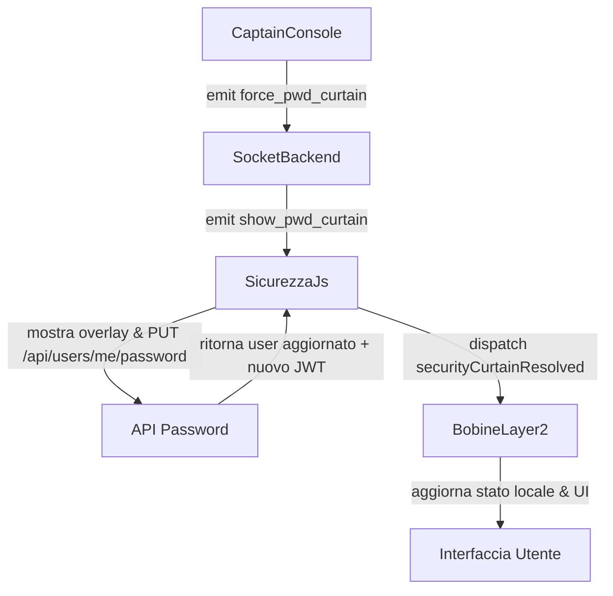

### Obiettivo

Implementare il "Sipario di Sicurezza" (Password Curtain) che blocca l’interfaccia in tempo reale quando il Captain forza il cambio password, senza ricaricare la pagina e preservando lo stato DOM delle app di Layer 2.

### Schema di flusso ad alto livello

### Passi nel backend Socket (`serverbobine.js`)

- **Individuare** il blocco `io.on('connection', (socket) => { ... })` in `[c:\Users\depel\Documents\progetto\ujet\bobine\serverbobine.js](c:\Users\depel\Documents\progetto\ujet\bobine\serverbobine.js)` subito sotto il listener esistente `socket.on('kick_user', ...)`.
- **Aggiungere** il nuovo listener `socket.on('force_pwd_curtain', ...)` esattamente con il codice fornito, che emette `show_pwd_curtain` verso la stanza `user_<ID>` e logga l’operazione.
- **Non modificare** nient’altro nel blocco di connessione Socket né nella logica di `kick_user`.

### Passi nella sicurezza globale (`sicurezza.js`)

- Nel blocco WebSocket dentro `initSecurity` (`if (typeof io !== 'undefined') { ... }`) in `[c:\Users\depel\Documents\progetto\ujet\bobine\sicurezza.js](c:\Users\depel\Documents\progetto\ujet\bobine\sicurezza.js)`, **aggiungere** subito dopo il listener `socket.on('force_logout', ...)` il nuovo listener `socket.on('show_pwd_curtain', ...)` che chiama `showPasswordCurtain(payload.message);`.
- **Sostituire interamente** l’implementazione attuale di `showPasswordCurtain()` con la versione fornita che:
  - Previene la creazione di overlay duplicati controllando `securityCurtain` nel DOM.
  - Crea un overlay full-screen con messaggio personalizzato, due campi password e pulsante “Aggiorna e Riprendi il Lavoro”.
  - Esegue la chiamata `PUT /api/users/me/password` con `oldPassword` e `newPassword` e gestisce correttamente errori JSON.
  - Aggiorna `window.SecurityData.user.forcePwdChange = false` se presente.
  - Emette `document.dispatchEvent(new CustomEvent('securityCurtainResolved', { detail: data.user }))` al successo.
  - Rimuove il DOM del sipario senza `window.location.reload()`.

### Passi nella Captain Console (`captain.html`)

- Nel modale `userManagePanel` in `[c:\Users\depel\Documents\progetto\ujet\bobine\captain.html](c:\Users\depel\Documents\progetto\ujet\bobine\captain.html)`, **sostituire** il bottone esistente `id="umpKickBtn"` (icona ⚡ Kick) con il nuovo bottone `id="umpForcePwdNowBtn"` e stile/testo esattamente come da specifica.
- Nel blocco `<script>` di fondo pagina:
  - **Rimuovere** il vecchio event listener associato a `document.getElementById('umpKickBtn')...` mantenendo intatte le altre funzioni (`kickUser`, `askCaptainConfirm`, `showCaptainSuccess`, ecc.).
  - **Aggiungere** il nuovo event listener per `umpForcePwdNowBtn` con logica fornita:
    - Recupero `targetId` da `#umpUserId`.
    - `askCaptainConfirm(...)` con testo di conferma del Sipario.
    - In caso di conferma, impostare `#umpForcePwdChange.checked = true` e simulare click su `#umpSaveSecBtn` per persistere `ForcePwdChange = 1` nel DB.
    - Inizializzare `captainSocket` via `io()` se necessario e `emit('force_pwd_curtain', { targetUserId: targetId });`.
    - Mostrare `showCaptainSuccess('Sipario di sicurezza calato con successo sull\'utente.');` o `alert` se Socket.io non è disponibile.
- **Non toccare** la funzione globale `kickUser` legata alla tabella utenti (rimane per il kick brutale da lista, diverso dal pulsante nel pannello utente).

### Passi nel Layer 2 Bobine (`bobine.js`)

- In fondo a `[c:\Users\depel\Documents\progetto\ujet\bobine\bobine.js](c:\Users\depel\Documents\progetto\ujet\bobine\bobine.js)`, dopo l’ultima logica esistente, **aggiungere** l’event listener globale:
  - `document.addEventListener('securityCurtainResolved', (e) => { ... })` che:
    - Verifica `state.currentOperator`.
    - Setta `state.currentOperator.forcePwdChange = false;` per riallineare lo stato locale.
    - Recupera `#profilePwdMsg` e, se esiste, azzera il testo per pulire eventuali messaggi di errore residui nel modale profilo.
- **Non modificare** la logica di sicurezza esistente basata sui 403 in `fetchData`, che continuerà a mostrare il modale profilo se il cambio non è stato ancora risolto.

### Aggiornamento documentazione (`conoscenze.txt`)

- Nella sezione esistente "Sicurezza Globale e Script `sicurezza.js`" in `[c:\Users\depel\Documents\progetto\ujet\bobine\conoscenze.txt](c:\Users\depel\Documents\progetto\ujet\bobine\conoscenze.txt)`:
  - **Sostituire** il blocco descrittivo del "Sipario" con il testo fornito, esplicitando che:
    - Il Sipario può essere attivato al caricamento (flag DB) o in tempo reale via WebSockets dalla Captain Console.
    - Alla fine aggiorna il JWT nei cookie e chiude il Sipario **senza ricaricare la pagina**, emettendo `securityCurtainResolved`.
    - **Regola di architettura**: tutte le nuove app di Layer 2 devono ascoltare `document.addEventListener('securityCurtainResolved', ...)` per azzerare `forcePwdChange` e allineare lo stato locale silenziosamente.

### Verifiche manuali

- **Scenario Captain**: dalla Captain Console aprire `userManagePanel`, abilitare `ForcePwdChange`, usare il nuovo bottone "Forza Pwd Ora" e verificare che:
  - Il DB venga aggiornato (tramite `umpSaveSecBtn`).
  - Venga inviato l’evento Socket `force_pwd_curtain` senza errori.
- **Scenario Operatore Bobine**:
  - Con un operatore loggato in `bobine.html`, verificare che alla ricezione di `show_pwd_curtain` appaia il Sipario sopra l’app, senza reload.
  - Inserire le password, confermare la PUT, verificare che il Sipario si chiuda, che `window.SecurityData.user.forcePwdChange` e `state.currentOperator.forcePwdChange` diventino `false` e che l’app resti nello stesso stato operativo.
- **Regressione Kick**: confermare che le funzioni di espulsione brutale (`kick_user` globale e `force_logout`) continuino a funzionare dalla tabella utenti (icone 🦵) senza interferenze col Sipario.

