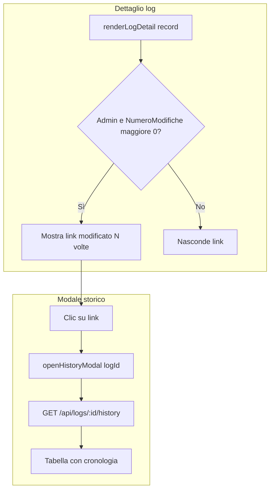

# Storico modifiche log - Piano di implementazione

## Contesto attuale

- **Backend**: [serverbobine.js](serverbobine.js) espone `GET /api/logs/:id` ma non restituisce `NumeroModifiche`, necessario per mostrare il link.
- **Frontend**: [app.js](app.js) contiene `renderLogDetail()` che usa `record.uniqueRecordId` e altri campi; `displayDate()` gestisce stringhe ISO (es. `"2025-02-28T12:34:56.789"`).
- **HTML**: [index.html](index.html) ha il modale scanner (`scannerModal`) prima del tag `<script src="app.js"></script>`.
- **CSS**: [styles.css](styles.css) non contiene stili per `.history-table` o `.history-link`.

## Modifiche richieste

### 1. Backend - serverbobine.js

**A. Aggiungere `NumeroModifiche` a `GET /api/logs/:id`**

Nel SELECT dell’endpoint (linee 143–154) includere `L.NumeroModifiche as NumeroModifiche` per permettere al frontend di mostrare il link.

**B. Nuovo endpoint `GET /api/logs/:id/history`**

Inserire subito dopo `GET /api/logs/:id` (dopo la linea 166):

```javascript
app.get('/api/logs/:id/history', async (req, res) => {
    const id = req.params.id;
    try {
        let pool = await sql.connect(dbConfig);
        let result = await pool.request()
            .input('IDLog', sql.Int, id)
            .query(`
                SELECT 
                    L.Quantity AS quantity,
                    L.Codart AS rawCode,
                    L.Lot AS lot,
                    L.Notes AS notes,
                    CONVERT(varchar(23), L.ValidFrom, 126) AS validFrom,
                    ISNULL(O_Mod.Operator, O_Crea.Operator) AS operatorName,
                    L.NumeroModifiche
                FROM [CMP].[dbo].[Log] FOR SYSTEM_TIME ALL AS L
                LEFT JOIN [CMP].[dbo].[Operators] O_Mod ON L.ModificatoDa = O_Mod.IDOperator
                LEFT JOIN [CMP].[dbo].[Operators] O_Crea ON L.IDOperator = O_Crea.IDOperator
                WHERE L.IDLog = @IDLog
                ORDER BY L.ValidFrom ASC
            `);
        res.json(result.recordset);
    } catch (err) {
        res.status(500).send(err.message);
    }
});
```

**Prerequisito**: La tabella `[CMP].[dbo].[Log]` deve essere una System-Versioned Temporal Table con colonne `ValidFrom` e `ValidTo`. In caso contrario, la query fallirà.

---

### 2. Frontend - index.html

**Modale storico**

Aggiungere il markup del modale subito dopo il `scannerModal` (dopo la linea 151) e prima di `<script src="https://cdn.jsdelivr.net/...">`:

```html
<div class="scanner-modal" id="historyModal" aria-hidden="true" aria-label="Storico Modifiche">
  <div class="scanner-modal-inner" style="width: 90%; max-width: 800px; max-height: 90vh; display: flex; flex-direction: column;">
    <p class="scanner-title" style="margin-bottom: 16px;">Storico Modifiche</p>
    <div style="overflow-x: auto; flex: 1; margin-bottom: 16px;">
      <table class="history-table" id="historyTable">
        <thead>
          <tr>
            <th>Data Modifica (UTC)</th>
            <th>Operatore</th>
            <th>Q.tà</th>
            <th>Cod. Art.</th>
            <th>Lotto</th>
            <th>Note</th>
          </tr>
        </thead>
        <tbody></tbody>
      </table>
    </div>
    <button type="button" class="scanner-cancel" id="historyCancel">Chiudi</button>
  </div>
</div>
```

---

### 3. Frontend - styles.css

**Stili per tabella e link**

Aggiungere in fondo al file (dopo la linea 531):

```css
/* --- Tabella Storico --- */
.history-table {
  width: 100%;
  border-collapse: collapse;
  font-size: var(--font-size-sm);
  text-align: left;
}
.history-table th, .history-table td {
  padding: 8px 12px;
  border: 1px solid var(--border);
}
.history-table th {
  background-color: var(--primary);
  color: white;
  font-weight: 600;
  position: sticky;
  top: 0;
}
.history-table tr:nth-child(even) { background-color: var(--bg); }
.history-table tr:hover { background-color: #e3eef8; }
.history-link {
  color: var(--primary);
  text-decoration: underline;
  cursor: pointer;
  margin-left: 10px;
  font-size: var(--font-size-sm);
  font-weight: normal;
}
```

---

### 4. Frontend - app.js

**A. Sostituire `renderLogDetail(record)`**

Sostituire la funzione attuale (linee 383–404) con la versione che include il link condizionale:

```javascript
function renderLogDetail(record) {
  detailGrid.innerHTML = '';
  
  const idContainer = document.createElement('div');
  idContainer.textContent = record.uniqueRecordId;
  
  if (state.currentOperator?.isAdmin && record.NumeroModifiche > 0) {
    const historyLink = document.createElement('span');
    historyLink.className = 'history-link';
    historyLink.textContent = `(modificato ${record.NumeroModifiche} volte)`;
    historyLink.onclick = () => openHistoryModal(record.uniqueRecordId);
    idContainer.appendChild(historyLink);
  }

  const rows = [
    ['ID Record', idContainer],
    ['Data', displayDate(record.date)],
    ['Operatore', record.operator ?? '-'],
    ['Macchina', record.machine ?? '-'],
    ['Codice Articolo', record.rawCode ?? '-'],
    ['Lotto', record.lot ?? '-'],
    ['Quantità', record.quantity != null ? String(record.quantity) : '-'],
    ['Note', record.notes ?? '-'],
    ['ID Bobina', record.rollId ?? '-']
  ];

  rows.forEach(([k, v]) => {
    const key = document.createElement('p');
    key.className = 'k';
    key.textContent = k;

    const value = document.createElement('div');
    value.className = 'v';
    if (v instanceof HTMLElement) {
      value.appendChild(v);
    } else {
      value.textContent = v;
    }

    detailGrid.append(key, value);
  });
}
```

**B. Nuove funzioni e listener**

Aggiungere prima di `initApp()` (circa linea 72):

```javascript
async function openHistoryModal(logId) {
  try {
    const historyData = await fetchData(`/logs/${logId}/history`);
    const tbody = document.querySelector('#historyTable tbody');
    tbody.innerHTML = '';
    
    historyData.forEach(row => {
      const tr = document.createElement('tr');
      const dataLabel = row.NumeroModifiche === 0 ? 'Creazione Originale' : displayDate(row.validFrom);
      
      tr.innerHTML = `
        <td>${dataLabel}</td>
        <td>${row.operatorName ?? '-'}</td>
        <td>${row.quantity ?? '-'}</td>
        <td>${row.rawCode ?? '-'}</td>
        <td>${row.lot ?? '-'}</td>
        <td>${row.notes ?? '-'}</td>
      `;
      tbody.appendChild(tr);
    });
    
    const modal = document.getElementById('historyModal');
    modal.classList.add('is-open');
    modal.setAttribute('aria-hidden', 'false');
  } catch (err) {
    alert('Errore caricamento storico: ' + err.message);
  }
}

function closeHistoryModal() {
  const modal = document.getElementById('historyModal');
  if (modal) {
    modal.classList.remove('is-open');
    modal.setAttribute('aria-hidden', 'true');
  }
}

document.getElementById('historyModal').addEventListener('click', (e) => {
  if (e.target.id === 'historyCancel' || e.target.id === 'historyModal') {
    e.preventDefault();
    e.stopPropagation();
    closeHistoryModal();
  }
});
```

**Nota**: `state.currentOperator?.isAdmin` considera `isAdmin === true` o `isAdmin === 1` (dal backend). Se l’operatore non è selezionato, il link non sarà visibile anche se l’utente è admin: l’operatore deve essere selezionato nel form (es. tramite scelta operatore o barcode) prima di aprire il dettaglio.

---

## Flusso logico




---

## Riepilogo file modificati


| File                               | Modifiche                                                                                               |
| ---------------------------------- | ------------------------------------------------------------------------------------------------------- |
| [serverbobine.js](serverbobine.js) | Aggiungere `NumeroModifiche` a GET /api/logs/:id; nuovo endpoint GET /api/logs/:id/history              |
| [index.html](index.html)           | Modale `historyModal` dopo `scannerModal`                                                               |
| [styles.css](styles.css)           | Stili `.history-table` e `.history-link`                                                                |
| [app.js](app.js)                   | Nuova `renderLogDetail` con link; `openHistoryModal`, `closeHistoryModal`; listener per chiusura modale |


## Verifica prerequisiti DB

- La tabella `[CMP].[dbo].[Log]` deve essere una System-Versioned Temporal Table con colonne `ValidFrom` e `ValidTo`.
- Devono esistere le colonne `ModificatoDa` e `NumeroModifiche`.

